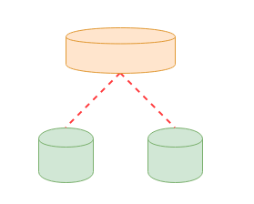
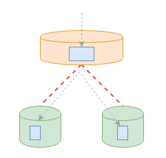
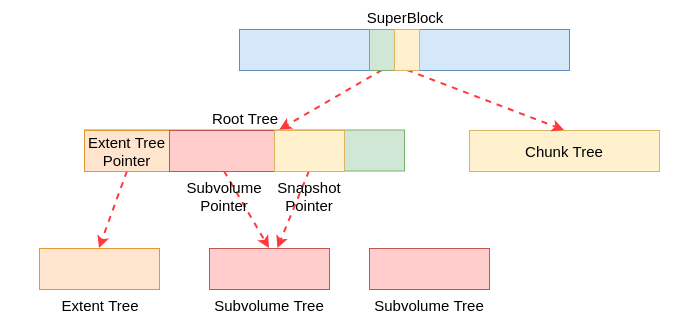
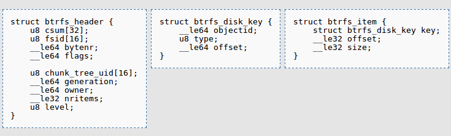
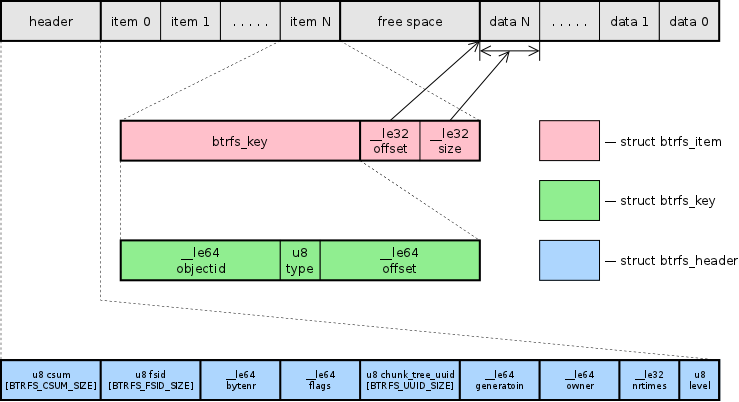
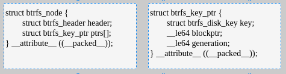
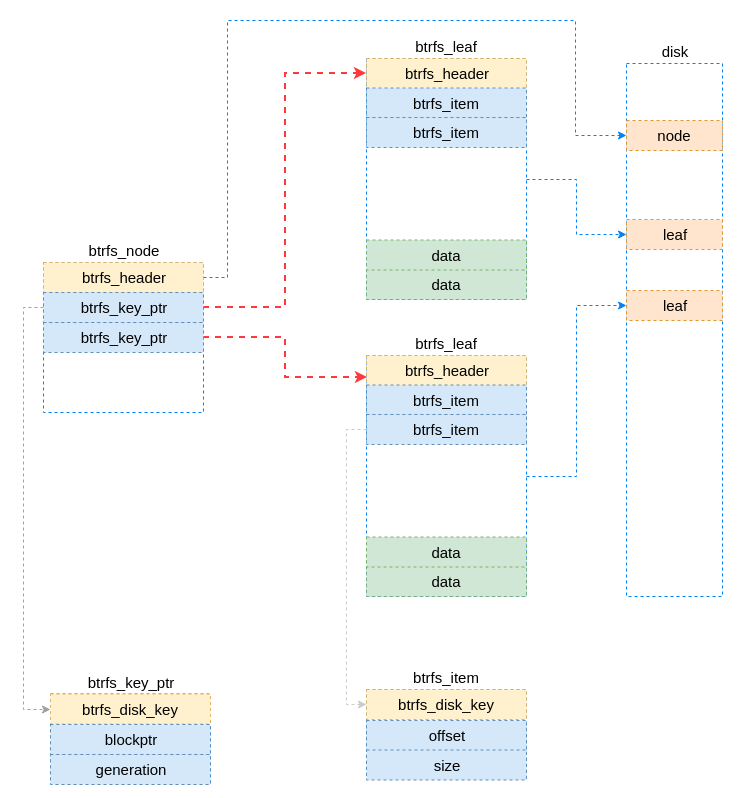

# 格式化
## 单磁盘默认参数格式化
在该种场景并不组建任何RAID，与其它文件系统相同，采用默认参数进行格式化。此时btrfs文件系统的元数据采用DUP方式存放，也就是元数据会存放多份，从而防止出现元数据损坏，数据丢失的情况。

[root@ol6u9ext3 btrfs_ana]# mkfs.btrfs /dev/sde 
btrfs-progs v4.2.2
See http://btrfs.wiki.kernel.org for more information.

WARNING: The skinny-metadata mkfs default feature will work with the current kernel, but it is not compatible with older kernels supported on this OS. You can disable it with -O ^skinny-metadata option in mkfs.btrfs
WARNING: The extref mkfs default feature will work with the current kernel, but it is not compatible with older kernels supported on this OS. You can disable it with -O ^extref option in mkfs.btrfs
Label:              (null)
UUID:               788d7460-d5c8-4399-93d3-89fb769bdfac
Node size:          16384
Sector size:        4096
Filesystem size:    12.00GiB
Block group profiles:
  Data:             single            8.00MiB
  Metadata:         DUP               1.01GiB
  System:           DUP              12.00MiB
SSD detected:       no
Incompat features:  extref, skinny-metadata
Number of devices:  1
Devices:
   ID        SIZE  PATH
    1    12.00GiB  /dev/sde


## 2个磁盘的RAID0
由2个硬盘组成RAID0构建文件系统，元数据和数据都采用RAID0的模式。此时两者是平铺在2块磁盘上的。

```
[root@ol6u9ext3 btrfs_ana]# mkfs.btrfs -m raid0 -d raid0 /dev/sdc /dev/sde -f
btrfs-progs v4.2.2
See http://btrfs.wiki.kernel.org for more information.

WARNING: The skinny-metadata mkfs default feature will work with the current kernel, but it is not compatible with older kernels supported on this OS. You can disable it with -O ^skinny-metadata option in mkfs.btrfs
WARNING: The extref mkfs default feature will work with the current kernel, but it is not compatible with older kernels supported on this OS. You can disable it with -O ^extref option in mkfs.btrfs
Label:              (null)
UUID:               1e3cc0c5-2049-4a1e-9eec-c6942accdcb0
Node size:          16384
Sector size:        4096
Filesystem size:    24.00GiB
Block group profiles:
  Data:             RAID0             2.01GiB
  Metadata:         RAID0             2.01GiB
  System:           RAID0            20.00MiB
SSD detected:       no
Incompat features:  extref, skinny-metadata
Number of devices:  2
Devices:
   ID        SIZE  PATH
    1    12.00GiB  /dev/sdc
    2    12.00GiB  /dev/sde
```

#Btrfs磁盘管理简述
Btrfs可以在多个磁盘上建立文件系统，管理磁盘的能力类似与Linux下面的卷管理（LVM），可以实现RAID0、RAID1、RAID5、RAID6和RAID10等模式。以RAID0为例，如图1所示，Btrfs会将两个磁盘抽象为一个大的逻辑硬盘。这样，所有文件系统级别的操作（例如分配磁盘空间等）都是在这个逻辑磁盘（这个逻辑盘在操作系统层面并不存在）上进行的。而当IO提交到逻辑盘之后，Btrfs中的插件根据磁盘的RAID形式和chunk树中存储的设备信息进行重新换算得到实际的物理设备及偏移信息，并重新构建新的bio。



仍然以2个磁盘构成的RAID0为例介绍一下写数据时IO处理的大致过程。假设该文件系统条带大小是4K，IO大小是8K，且是4K对齐的。文件系统的前期处理流程与其它文件系统没有多少差异，前期仍然是给该写请求的数据分配磁盘空间，也就是确定数据落入磁盘的偏移。而此时的偏移是上面所述的逻辑磁盘的偏移。最终是调用writepages接口将缓存数据写入磁盘，此时不是直接调用submit_bio接口，而是调用btrfs自己封装的一个submit_one_bio接口,该接口用于向逻辑磁盘提交IO，而在该流程中封装了一个IO重映射的逻辑，也就是将上述逻辑地址转换称物理地址。对于RAID0，此IO将会被切割为2个IO，并映射到2个独立的物理磁盘，然后调用submit_stripe_bio将切割后的IO提交到物理磁盘。



# 文件系统磁盘布局
Btrfs遵循Linux文件系统的惯例，照例以超级块作为文件系统的入口，并在超级块中描述了该文件系统的属性。在超级块中有2个比较重要的域，分别是root和chunck_root，这两个域分别指向了**树根树**和**chunck树**的根的逻辑位置（注意，这里是逻辑位置，而不是磁盘的物理位置，下文详述）。

## 超级块与B+树
Btrfs文件系统的所有数据都是通过这2棵树进行维护的。一个是chunk树，这个里面保存着文件系统的设备信息。另外一个是树根树，在这个树里面包含着很多其它树的树根。一个刚刚格式化的文件系统包含如下根：
- 树根树
- 分配extent的树
- 缺省子卷的树


树根树记录了extent树的根块以及每个子卷树和快照树的根块和名称。当有事务提交时，根块的指针将会被事务更新为新的值。此时该树新的根块将被记录在FS的超级块中。

The tree of tree roots records the root block for the extent tree and the root blocks and names for each subvolume and snapshot tree. As transactions commit, the root block pointers are updated in this tree to reference the new roots created by the transaction, and then the new root block of this tree is recorded in the FS super block.

在文件系统中树根树好像是其它树的文件夹，而且它有该文件系统的记录着所有快照和子卷名称的文件夹项。在树根树中，每一个快照和子卷都有一个objectid，并且最少有一个对应的btrfs_root_item结构体。树中的目录项建立了快照和子卷名称与这些根项（btrfs_root_item）的关联关系。由于每次事务提交的时候根项Key都会被更新，因此目录项的generation的值是(u64)-1，这样可以使查找代码找到最近的可用根。

The tree of tree roots acts as a directory of all the other trees on the filesystem, and it has directory items recording the names of all snapshots and subvolumes in the FS. Each snapshot or subvolume has an objectid in the tree of tree roots, and at least one corresponding struct btrfs_root_item. Directory items in the tree map names of snapshots and subvolumes to these root items. Because the root item key is updated with every transaction commit, the directory items reference a generation number of (u64)-1, which tells the lookup code to find the most recent root available.

extent树用于在设备上管理已经分配的空间。剩余空间能够被划分为多个extent树，这样可以减少锁碰撞，而且为不同的空间提供不同的分配策略。
The extent trees are used to manage allocated space on the devices. The space available can be divided between a number of extent trees to reduce lock contention and give different allocation policies to different block ranges.

如图1描绘了一个树根的集合。超级块指向根树，根树又指向extent树和子卷树。根树也有一个文件夹来映射子卷名称和在根树中的btrfs_root_items结构体。本文件系统有一个名为default的子卷（该子卷在格式化时创建）和一个该子卷的名为snap的快照（由管理员在稍晚的时候创建的）。本例中，该子卷在快照创建后没有发生任何变化，因此两者的指针是指向同一颗树的根。

The diagram below depicts a collection of tree roots. The super block points to the root tree, and the root tree points to the extent trees and subvolumes. The root tree also has a directory to map subvolume names to struct btrfs_root_items in the root tree. This filesystem has one subvolume named 'default' (created by mkfs), and one snapshot of 'default' named 'snap' (created by the admin some time later). In this example, 'default' has not changed since the snapshot was created and so both point tree to the same root block on disk. 


FS Tree 管理文件相关的元数据，如 inode，dir等； Chunk tree管理设备，每一个磁盘设备都在Chunk Tree中有一个item；Extent Tree管理磁盘空间分配，btrfs每分配一段磁盘空间，便将该磁盘空间的信息插入到Extent tree。查询Extent Tree将得到空闲的磁盘空间信息；checksum Tree 保存数据块的校验和；Tree of tree root保存很多 BTree 的根节点。比如用户每建立一个快照，btrfs 便会创建一个FS Tree。


## Btrfs BTree的组织形式

既然说到了Btree，就不能不提Btrfs中的一些Btree设施，先来看下extent_buffer。顾名思义，即是extent在内存中的缓冲，它是btrfs文件系统磁盘空间管理的核心，btrfs通过btree来管理各种元数据，比如inode、目录项等。这些B+树的每一个节点（包括叶子节点和上层节点）都存储在一个单位的extent中，每次要读取元数据或者要向磁盘写入元数据，则通常先先将数据读入extent_buffer或者向extent_buffe写入数据。

Btrfs的BTree提供了一种通用的方法来存储不同的数据类型（具体类型请参考后文）。在内部，它仅仅知道3中数据结构，分别是键、项目和块头。这3中数据结构的定义如图4所示，分别是`btrfs_disk_key`、`btrfs_item`和`btrfs_header`.
The Btrfs btree provides a generic facility to store a variety of data types. Internally it only knows about three data structures: keys, items, and a block header: 




树的上层节点（非叶子节点）仅仅包含键-块指针对。树的叶子节点被分为2部分，并且向彼此生长（也就是前半部分从磁盘块的头向尾使用空间，而后半部分则是从磁盘块的尾向头使用空间）。叶子节点有一个固定大小项（也就是btrfs_item数据结构）的数组，以及存储项数据的区域。在btrfs_item数据结构中的偏移和大小域指示了如何从本叶子节点找到项数据。图5是BTree叶子节点布局的示意图。

Upper nodes of the trees contain only [ key, block pointer ] pairs. Tree leaves are broken up into two sections that grow toward each other. Leaves have an array of fixed sized items, and an area where item data is stored. The offset and size fields in the item indicate where in the leaf the item data can be found. Example: 



项数据的大小是可变的，并且定义了各种文件系统数据结构来表示不同类型的项数据。数据结构btrfs_disk_key中的type字段指示存储在项中的数据类型。

Item data is variably size, and various filesystem data structures are defined as different types of item data. The type field in struct btrfs_disk_key indicates the type of data stored in the item. 

块头包含块内容的校验和、拥有该块的文件系统的UUID、树中该块的层次（区别该块为叶子节点还是中间节点）以及该块应该所在的块号。这些字段允许在读取数据时验证元数据的内容。任何指向BTree块的内容都存储了它期望该块具有的generation字段。这允许BTRFS检测介质上的虚写或错位写入。

The block header contains a checksum for the block contents, the uuid of the filesystem that owns the block, the level of the block in the tree, and the block number where this block is supposed to live. These fields allow the contents of the metadata to be verified when the data is read. Everything that points to a btree block also stores the generation field it expects that block to have. This allows Btrfs to detect phantom or misplaced writes on the media. 

较低节点的校验和不存储在节点指针中，以简化FS写回代码。在块插入BTree的时候可以知道generation的值，但校验和仅在将块写入磁盘之前才会计算。使用generation将允许BTRFS检测幻象写入（假写），而不必在每次更新较低节点校验和时查找和更新较高节点。

The checksum of the lower node is not stored in the node pointer to simplify the FS writeback code. The generation number will be known at the time the block is inserted into the btree, but the checksum is only calculated before writing the block to disk. Using the generation will allow Btrfs to detect phantom writes without having to find and update the upper node each time the lower node checksum is updated.

generation字段与分配块的事务ID相对应，该ID使增量备份变得容易，并由copy-on-write事务子系统使用。

The generation field corresponds to the transaction id that allocated the block, which enables easy incremental backups and is used by the copy on write transaction subsystem. 

说了这么多，也用图示的方式说明了叶子节点的磁盘布局情况，下面是叶子节点的数据结构。可以看出最前面是该数据结构最前面是btrfs_header数据结构，紧跟着是btrfs_item结构的数组。而项数据并不在该数据结构中体现，因为项数据类型是不确定的，关于项数据的获取是通过项的记录动态解析的。

```
struct btrfs_leaf {
        struct btrfs_header header;
        struct btrfs_item items[];
} __attribute__ ((__packed__));
```

前文重点介绍了叶子节点，除了叶子节点之外还有非叶子节点，也就是中间节点和根节点。前文已经交代，BTree只在叶子存储具体的数据信息，而非叶子节点则只存储键-指针对。非叶子节点涉及的数据结构如图6所示，其与叶子节点的差异是在btrfs_header之后是btrfs_key_ptr数据结构的数组。



可以看出其前面跟叶子节点一样，同样包含一个btrfs_header，而之后则是btrfs_key_ptr数据结构。该数据结构内部包含一个btrfs_disk_key和其指向的磁盘块的位置及generation信息。

下面给出一个包含非叶子节点和叶子节点的简单结构的BTree示意图，这里面包含一个根节点和两个叶子节点。图中红色虚线是数据块的指向关系。蓝色虚线指示该数据在磁盘上的存储位置，灰色虚线则用于说明该数据结构的详细定义。



## 项类型及数据结构
前文大致介绍了Btrfs BTree涉及的数据结构及大概组织关系。并且提到

下面这张表展示了BTree的键类型与该类型存储的数据类型之间的关系。通常来说，btrfs_item_ptr宏定义可以用来获取。

This table shows the mapping from the btree key type to the type of data stored against that key. In general, the btrfs_item_ptr() macro can be used to retrieve a properly-typed offset value for the data. The btrfs_datatype_membername() and btrfs_datatype_set_membername() functions can then be used to retrieve any data from the leaf/slot (which are themselves obtained from the struct path data returned from btrfs_search_slot()).

The "Tree(s)" column indicates which trees items of that type can appear in, and the objectid and offset columns document what the values in the objectid and offset fields should be for the key for this type of object.

Note: The information in this table is incomplete and has not yet been checked by someone who knows what they're doing.

|Type name| 	Value| 	Data type| 	Tree(s) |	objectid| 	offset |	Notes|
|-|-|-|-|-|-|-|
|BTRFS_INODE_ITEM_KEY	|1 	|struct btrfs_inode_item	|root, fs, reloc, file| 	inode number| 	0 |	Use btrfs_iget() and btrfs_iget_locked() to read the inode data as a struct inode.|
|BTRFS_INODE_REF_KEY	|12 |struct btrfs_inode_ref		|root, fs, reloc, file| 	inode number| inode number of parent 	||
|BTRFS_INODE_EXTREF_KEY	|13	|struct btrfs_inode_extref	| |inode number| 	|crc32c hash of filename, using inode number of parent as seed 	Used if the regarding inode_ref array ran out of space. Requires the EXTENDED_IREF feature.|
BTRFS_XATTR_ITEM_KEY 	24 	struct btrfs_dir_item
	file 	inode number of object 	crc32c hash of xattr name 	Embedded data in btrfs_dir_item is xattr value
BTRFS_ORPHAN_ITEM_KEY 	48 	- 				Doesn't map to a struct type.
BTRFS_DIR_LOG_ITEM_KEY 	60 	struct btrfs_dir_log_item 				
BTRFS_DIR_LOG_INDEX_KEY 	72 	(?) 				
BTRFS_DIR_ITEM_KEY 	84 	struct btrfs_dir_item root, fs, file
	inode number of directory 	crc32c hash of filename 	References an item in this directory
BTRFS_DIR_INDEX_KEY 	96 	struct btrfs_dir_item fs, file	inode number of directory 	index of item 	References an item in this directory
BTRFS_EXTENT_DATA_KEY 	108 	struct btrfs_file_extent_item 	file 	inode number 	offset within file 	
BTRFS_EXTENT_CSUM_KEY 	128 	struct btrfs_csum_item 	checksum 	BTRFS_EXTENT_CSUM_OBJECTID == -10ULL 	address of start of data 	
BTRFS_ROOT_ITEM_KEY 	132 	struct btrfs_root_item (?)	root 	BTRFS_EXTENT_TREE_OBJECTID 	0 	
BTRFS_DEV_TREE_OBJECTID 	0 	BTRFS_FS_TREE_OBJECTID 	0 	References the base fs tree
BTRFS_CSUM_TREE_OBJECTID 	0 	id number of subvolume 	generation of parent when created, or 0 if not a snapshot 	References a file tree
BTRFS_ROOT_BACKREF_KEY 	144 	struct btrfs_root_ref 	root 	child subvolume id 	parent subvolume id 	
BTRFS_ROOT_REF_KEY 	156 	struct btrfs_root_ref 	root 	parent subvolume id 	child subvolume id 	
BTRFS_EXTENT_ITEM_KEY 	168 	struct btrfs_extent_item 	extent 	virtual address of extent 	size of extent 	
BTRFS_EXTENT_REF_V0_KEY 	180 	struct btrfs_extent_ref_v0 				
BTRFS_TREE_BLOCK_REF_KEY 	176 	- 	extent 	Not directly indexed 	

See struct btrfs_extent_item and struct btrfs_extent_inline_ref
BTRFS_EXTENT_DATA_REF_KEY 	178
BTRFS_SHARED_BLOCK_REF_KEY 	182
BTRFS_SHARED_DATA_REF_KEY 	184
BTRFS_BLOCK_GROUP_ITEM_KEY 	192 	

struct btrfs_block_group_item
	extent 	address of start of group 	length of block group 	
BTRFS_DEV_EXTENT_KEY 	204 	

struct btrfs_dev_extent
	device 	device id 	location on device 	
BTRFS_DEV_ITEM_KEY 	216 	

struct btrfs_dev_item
	chunk 	BTRFS_DEV_ITEMS_OBJECTID == 1ULL 	device id 	
BTRFS_CHUNK_ITEM_KEY 	228 	

struct btrfs_chunk
	chunk 	tree id (currently always BTRFS_FIRST_CHUNK_TREE_OBJECTID == 256ULL) 	virtual address of chunk 	
BTRFS_STRING_ITEM_KEY 	253 	char[] (?) 	Any? 			string items are for debugging. They just store a short string of data in the FS 

# 文件
占用空间小于一个叶子节点磁盘空间的小文件。此时，key的偏移是在本文件中的以字节为单位的偏移，而结构体btrfs_item中的size域则指示了有多少数据被存储。

Small files that occupy less than one leaf block may be packed into the btree inside the extent item. In this case the key offset is the byte offset of the data in the file, and the size field of struct btrfs_item indicates how much data is stored. There may be more than one of these per file.

大文件将以extent的模式进行存储。结构体btrfs_file_extent_item中记录着extent的generation数、  。extent同时存储着逻辑偏移和被该extent使用的块的数量。这样可以使btrfs在出现对一个extent中间位置进行改写时不用读取旧的数据。例如，向一个128MB的extent中写入1MB的数据，此时将产生3个extent记录。
[ old extent: bytes 0-64MB ], [ new extent 1MB ], [ old extent: bytes 65MB – 128MB]

Larger files are stored in extents. struct btrfs_file_extent_item records a generation number for the extent and a [ disk block, disk num blocks ] pair to record the area of disk corresponding to the file. Extents also store the logical offset and the number of blocks used by this extent record into the extent on disk. This allows Btrfs to satisfy a rewrite into the middle of an extent without having to read the old file data first. For example, writing 1MB into the middle of a existing 128MB extent may result in three extent records: 

占用少于一个叶块的小文件可以打包到扩展项内的btree中。在这种情况下，键偏移量是文件中数据的字节偏移量，结构btrfs_项的大小字段指示存储了多少数据。每个文件可能不止一个。


较大的文件存储在扩展数据块中。struct btrfs_file_extent_item记录扩展数据块的生成号和一对[disk block，disk num blocks]记录文件对应的磁盘区域。扩展数据块还将逻辑偏移量和此扩展数据块记录使用的块数存储到磁盘上的扩展数据块中。这使得btrfs可以在不需要先读取旧文件数据的情况下，将重写操作满足到数据块的中间。例如，将1MB写入现有128MB数据块的中间可能会导致三个数据块记录：

# 写数据流程


# 读数据流程

# 磁盘布局相关数据结构

 btrfs_file_extent_item

Represents a chunk of data on disk belonging to a file. In the fs-trees, the corresponding key is (<inum> EXTENT_DATA <logical offset>). The <logical offset> is in (uncompressed) bytes within the file belonging to inode <inum>.
struct btrfs_file_extent_item (53 bytes)

|offset| 	type| 	field| 	description|
|----|----|----|----|
|0| 	__le64 	|generation| transaction id that created this extent|
8 	__le64 	ram_bytes 	size of the device
16 	__u8 	compression 	Compression type. Can be one of: BTRFS_COMPRESS_NONE (0), BTRFS_COMPRESS_ZLIB (1) and BTRFS_COMPRESS_LZO (2)
17 	__u8 	encryption 	encryption type, currently always set to 0
18 	__le16 	other_encoding 	Currently unused, allows for future expansion.
20 	__u8 	type 	Type of extent. Can be BTRFS_FILE_EXTENT_INLINE (0), BTRFS_FILE_EXTENT_REG (1) or BTRFS_FILE_EXTENT_PREALLOC (2). For inline extents the file contents immediately follow the type byte. The length of the inline data block equals ram_bytes, alternatively it can be read from the inode or computed as the size stored in the corresponding btrfs_item-structure less the (partial) size of the btrfs_file_extent_item-structure.
The following fields apply to BTRFS_FILE_EXTENT_REG/BTRFS_FILE_EXTENT_PREALLOC extents only
21 	__le64 	disk_bytenr 	Logical address for the start of the extent data. Note: This is the key.objectid for the corresponding EXTENT_ITEM.
29 	__le64 	disk_num_bytes 	Number of on-disk bytes of the extent (compressed). Note: This is the key.offset for the corresponding EXTENT_ITEM.
37 	__le64 	offset 	Offset into the extent item. Number of bytes to skip at the beginning (uncompressed).
45 	__le64 	num_bytes 	Number of valid bytes within the file extent item (uncompressed). This always reflects the size uncompressed and without encoding. 

## 超级块（btrfs_super_block）

The primary superblock is located at 0x1 0000 (6410 KiB). Mirror copies of the superblock are located at physical addresses 0x400 0000 (6410 MiB), 0x40 0000 0000 (25610 GiB), and 0x4 0000 0000 0000 (1 PiB), if these locations are valid. btrfs normally updates all superblocks, but in SSD mode it will update only one at a time. The superblock with the highest generation is used when reading.

Note that btrfs only recognizes disks with a valid 0x1 0000 superblock; otherwise, there would be confusion with other filesystems.

|偏移（Off） |大小（Size）|类型（Type）|域名称（field）|描述（Description）|
|-|-|-|-|-|
|0  	|20    | u8[BTRFS_CSUM_SIZE]| 	csum| 	Checksum of everything past this field (from 20 to 1000)|
|20 | 	10| 	u8[BTRFS_FSID_SIZE] |	fsid| 	FS UUID 文件系统的UUID|
|30| 	8 |	__le64	|bytenr|  	physical address of this block (different for mirrors)|
|38 	|8  |			__le64| 	flags| |
|40 	|8 	|	__le64 |	magic|  	magic ("_BHRfS_M")|
|48 	|8  | 	__le64 	|generation|  	generation|
|50 	|8  |	__le64 |	root|  	logical address of the root tree root|
|58 	|8  |	__le64 	|chunck_root |logical address of the chunk tree root|
|60 	|8  |	__le64 |	log_root|  	logical address of the log tree root|
|68 	|8  |	__le64 |	log_root_transid | 	log_root_transid|
|70 	|8  |	__le64 |	total_bytes | 	total_bytes|
|78 	|8 | 	__le64 |	bytes_used | 	bytes_used| 
|80 	|8  |	__le64 |	root_dir_objectid|  	root_dir_objectid (usually 6)| 
|88 	|8  |	__le64 |	num_devices | 	num_devices| 
|90 	|4 | 	__le64 |	sectorsize | 	sectorsize| 
|94 	|4 | 	__le64 |	nodesize | 	nodesize| 
|98 	|4 | 	__le64 |	__unused_leafsize|  	leafsize| 
|9c 	|4 |	__le64 |	stripesize | 	stripesize| 
|a0 	|4 |	__le64 |sys_chunk_array_size |	sys_chunk_array_size| 
|a4 	|8 | 	__le64 |	chunk_root_generation| 	chunk_root_generation| 
|ac 	|8 |	__le64 |	compat_flags 	|compat_flags|
|b4 	|8 |	__le64 |	compat_ro_flags| 	compat_ro_flags - only implementations that support the flags can write to the filesystem|
|bc 	|8  |		__le64| 	incompat_flags| 	incompat_flags - only implementations that support the flags can use the filesystem|
|c4 	|2  |		|__le64| 	csum_type| 	csum_type - Btrfs currently uses the CRC32c little-endian hash function with seed -1.|
|c6 	|1  |		u8 |	root_level| 	root_level|
|c7 	|1  |		u8 |	chunk_root_level| 	chunk_root_level|
|c8 	|1  |		u8 |	log_root_level |	log_root_level|
|c9 	|62  |		btrfs_dev_item 	dev_item 	|DEV_ITEM data for this device|
|12b 	|100  |		char[BTRFS_LABEL_SIZE] 	label 	label (may not contain '/' or '\\')
|22b 	|8  |		__le64 	cache_generation 	cache_generation
|233 	|8  |		__le64 	uuid_tree+generation 	uuid_tree_generation
|23b 	|f0  |		__le64 	reserved[30] 	reserved /* future expansion */
|32b 	|800 |	 	u8 	sys_chunk_array[BTRFS_SYSTEM_CHUNK_ARRAY_SIZE] 	

sys_chunk_array:(n bytes valid) Contains (KEY, CHUNK_ITEM) pairs for all SYSTEM chunks. This is needed to bootstrap the mapping from logical addresses to physical.
|b2b 	|2a0  |		btrfs_root_backup 	super_roots[BTRFS_NUM_BACKUP_ROOTS] 	Contain super_roots (4 btrfs_root_backup)
|dcb 	|235  |				current unused
|1000 |


## 类型


# 延迟分配
Allocate-on-flush (also called delayed allocation) is a file system feature implemented in HFS+,[1] XFS, Reiser4, ZFS, Btrfs, and ext4.[2] The feature also closely resembles an older technique that Berkeley's UFS called "block reallocation".

When blocks must be allocated to hold pending writes, disk space for the appended data is subtracted from the free-space counter, but not actually allocated in the free-space bitmap. Instead, the appended data are held in memory until they must be flushed to storage due to memory pressure, when the kernel decides to flush dirty buffers, or when the application performs the Unix "sync" system call, for example.

This has the effect of batching together allocations into larger runs. Such delayed processing reduces CPU usage, and tends to reduce disk fragmentation, especially for files which grow slowly. It can also help in keeping allocations contiguous when there are several files growing at the same time. When used in conjunction with copy on write as it is in ZFS, it can convert slow random writes into fast sequential writes. 

# 参考文献
https://btrfs.wiki.kernel.org/index.php/Data_Structures#CHUNK_ITEM_.28e4.29
https://btrfs.wiki.kernel.org/index.php/Btrfs_design
https://btrfs.wiki.kernel.org/index.php/On-disk_Format
https://btrfs.wiki.kernel.org/index.php/Btree_Items