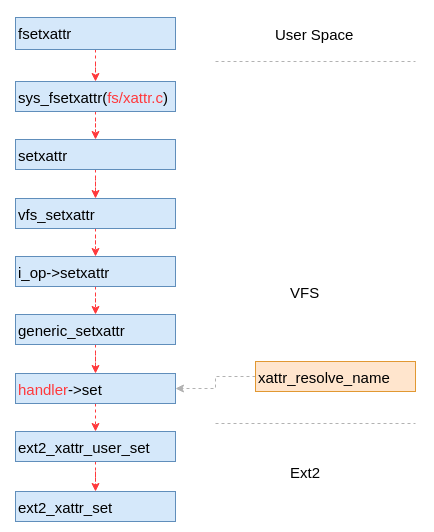

# 格式化文件系统

```
[root@ol6u9ext3 mnt]# mkfs.ext2 /dev/sdd
mke2fs 1.43-WIP (20-Jun-2013)
/dev/sdd is entire device, not just one partition!
无论如何也要继续? (y,n) y
文件系统标签=
OS type: Linux
块大小=4096 (log=2)
分块大小=4096 (log=2)
Stride=0 blocks, Stripe width=0 blocks
786432 inodes, 3145728 blocks
157286 blocks (5.00%) reserved for the super user
第一个数据块=0
Maximum filesystem blocks=3221225472
96 block groups
32768 blocks per group, 32768 fragments per group
8192 inodes per group
Superblock backups stored on blocks: 
	32768, 98304, 163840, 229376, 294912, 819200, 884736, 1605632, 2654208

Allocating group tables: 完成                            
正在写入inode表: 完成                            
Writing superblocks and filesystem accounting information: 完成 

```

# 磁盘布局与超级块

## 概述
Ext2文件系统将磁盘划分为大小相等的逻辑块进行管理（默认4KB，本文后续内容都采用该默认值。该值在格式化的时候可以指定），就好像一个大厦划分为若干个房间，或者超市规划为若干货架一样。同时为了便于管理和避免访问冲突，其将若干个逻辑块组成一个大的逻辑块，称为块组（Block Group）。块组是Ext2文件系统的管理单元，块组中又包含若干管理数据（元数据）实现对块组中的逻辑块的管理，比如那些逻辑块是什么功能，那些逻辑块已经被使用等等。


通过一个大厦对一个磁盘进行类比在形象不过了。大厦框架好比磁盘；而房间是对大厦规划后的结果，好比对磁盘的格式化；大厦每层的布局图好比元数据。我们可以通过楼层和每层的布局图很容易的找到房间。文件系统与此类似，它通过元数据查找和管理逻辑块。

如图2是某大厦楼层布局示意图。每层都被划分为不同的房间，并赋予房间号及不同的功能。可能有打印室、洗手间和茶水室等等。我们通过示意图和房间号可以很容易找到具体位置。


如图3是Ext2文件系统的磁盘布局图。如中间蓝色为磁盘的逻辑空间，它被划分为若干个块组。每个块组的大小相等。如果我们在格式化的时候采用的是默认参数，此时块组的大小是128MB（后面介绍为什么是128MB），每个逻辑块的大小是4KB。

## 整体布局
每个块组内部都有相关的元数据对该块组进行管理。如图3所示，第一个块组中的元数据包括引导块、超级块、块组描述符、预留GDT块、数据块位图、inode位图、inode表和其它数据块。后续块组中有些是对超级块的备份，有些则没有第一个块组这么完整的元数据信息，而只有数据块位图、inode位图和inode表等元数据信息。也就是说块组其实分为两种，一种是有超级块的，比较复杂的块组（如图3下面淡棕色所示），另外一种是没有超级块的，比较简单的块组（如图3上面淡绿色所示）。


引导块是作为引导操作系统用的，在文件系统作为根文件系统时使用。在系统加电启动是，其内容有BIOS自动装载并执行。它包含一个启动装载程序，用于从计算机安装的操作系统中选择一个启动，还负责继续启动过程。因此Ext2文件系统把这个区域预留出来，不作为文件系统管理的磁盘区域。

超级块是文件系统起始位置，用于整个文件系统，它作为文件系统的入口，记录了整个文件系统的关键信息。而上面提到的其它元数据则只针对本块组。下面本文介绍一下每个元数据的具体作用。

### 超级块（SuperBlock）

超级块记录了整个文件系统的各种信息，包括逻辑块的数量、inode数量、支持的特性和维护信息等内容。为了保证整个文件系统的完整性，例如突然断电或者系统崩溃等场景，文件系统出现元数据损坏的情况，Ext2文件系统对超级块进行了备份。这样可以保证即使在第一个超级块出现损坏的情况下，仍然可以通过其它块组中的超级块进行恢复，不至于整个文件系统都不可访问。

超级块位于第1个逻辑块内，由于第一个块组预留了1KB的内容另作它用，因此在该块组超级块的位置在1KB偏移处，而其它备份块组中的超级块都在该块组偏移为0的地方。超级块会占用1个逻辑块的空间（实际占用空间要小于该值），也就是说块组描述符（ext2_group_desc）是在4KB偏移的地方。如下代码是超级块在磁盘存放的结构体，磁盘数据被读出来后按照该结构体的格式进行解析，其中变量__lexx表示变量是小端对齐，使用是需要转换为CPU的对齐方式。在文件系统中还有另外一个结构体super_block，这个结构体用于代码逻辑中使用。

```
struct ext2_super_block {
        __le32  s_inodes_count;         /* 整个文件系统inode的数量 */
        __le32  s_blocks_count;         /* 整个文件系统逻辑块的数量 */
        __le32  s_r_blocks_count;       /* Reserved blocks count */
        __le32  s_free_blocks_count;    /* 文件系统剩余逻辑块的数量 */
        __le32  s_free_inodes_count;    /* 文件系统剩余inode的数量 */
        __le32  s_first_data_block;     /* First Data Block */
        __le32  s_log_block_size;       /* Block size */
        __le32  s_log_frag_size;        /* Fragment size */
        __le32  s_blocks_per_group;     /* 每一个块组中逻辑块的数量 */
        __le32  s_frags_per_group;      /* # Fragments per group */
        __le32  s_inodes_per_group;     /* 每一个块组中inode的数量 */
        __le32  s_mtime;                /* 挂载时间 */
        __le32  s_wtime;                /* 写时间 */
        __le16  s_mnt_count;            /* 挂载数量 */
        __le16  s_max_mnt_count;        /* Maximal mount count */
        __le16  s_magic;                /* Magic signature */
        __le16  s_state;                /* File system state */
        __le16  s_errors;               /* Behaviour when detecting errors */
        __le16  s_minor_rev_level;      /* minor revision level */
        __le32  s_lastcheck;            /* time of last check */
        __le32  s_checkinterval;        /* max. time between checks */
        __le32  s_creator_os;           /* OS */
        __le32  s_rev_level;            /* Revision level */
        __le16  s_def_resuid;           /* Default uid for reserved blocks */
        __le16  s_def_resgid;           /* Default gid for reserved blocks */
        __le32  s_first_ino;            /* 第一个非保留inode的id，ext2有一些保留的inode，比如2用于根目录 */
        __le16   s_inode_size;          /* inode结构体的大小 */
        __le16  s_block_group_nr;       /* 本超级块所位于的块组的编号 */
        __le32  s_feature_compat;       /* compatible feature set */
        __le32  s_feature_incompat;     /* incompatible feature set */
        __le32  s_feature_ro_compat;    /* readonly-compatible feature set */
        __u8    s_uuid[16];             /* 128-bit uuid for volume */
        char    s_volume_name[16];      /* volume name */
        char    s_last_mounted[64];     /* directory where last mounted */
        __le32  s_algorithm_usage_bitmap; /* For compression */
        /*
         * Performance hints.  Directory preallocation should only
         * happen if the EXT2_COMPAT_PREALLOC flag is on.
         */
        __u8    s_prealloc_blocks;      /* Nr of blocks to try to preallocate*/
        __u8    s_prealloc_dir_blocks;  /* Nr to preallocate for dirs */
        __u16   s_padding1;
        ... ...
};
```

**块组描述符**

块组描述符，顾名思义是对该块组的描述，其中包括该块组中数据块位图的位置、inode位图位置和inode表位置等信息。另外，还包括数据块和inode的剩余情况等信息。块组描述符位于第2个逻辑块，占用一个逻辑块的空间。
```
struct ext2_group_desc
{                                                   
        __le32  bg_block_bitmap;                /* Blocks bitmap block */ 
        __le32  bg_inode_bitmap;                /* Inodes bitmap block */
        __le32  bg_inode_table;         /* Inodes table block */
        __le16  bg_free_blocks_count;   /* Free blocks count */
        __le16  bg_free_inodes_count;   /* Free inodes count */
        __le16  bg_used_dirs_count;     /* Directories count */
        __le16  bg_pad;
        __le32  bg_reserved[3];
};
```

**数据块位图**

数据块位图标识了块组中那个数据块被使用了，那个没有被使用。每个逻辑块用1bit进行表示，0为未使用，1为已经使用。
数据块位图占用1个逻辑块，对于默认块大小(4KB)情况，可以管理4096*8个逻辑块，也即4096*8*4096=128MB的空间。当然如果格式化的时候块大小为8KB，则管理的空间会更大一些。

**inode位图**

inode位图与逻辑块位图类似，描述inode的使用情况。inode用于唯一标识一个文件，其为一个编号。文件系统根据这个编号查找具体的问题。在inode位图中每一位标inode表中的个inode是否被使用。
默认情况inode位图占用的空间也为4KB。

**inode表**

inode表一列表的形式保存了文件的元数据信息，包括文件大小、扩展属性和时间等内容。由于inode结构的大小根据格式化文件系统的属性而有差异，因此该表占用的磁盘空间不定，大概若干个逻辑块的大小。

本文简要介绍一下Ext4文件系统的磁盘布局情况，后续会更加详细的介绍每一部分的细节。

在Linux操作系统的文件系统中，超级块相当于文件系统的地图。在超级块中保存着`文件系统的属性信息、磁盘布局和资源使用情况`等信息。文件系统通过超级块了解磁盘的布局，查找已用和可用资源等。超级块又相当于入口，文件系统的操作通常从超级块开始。

对于Ext4文件系统，我们之前文章已经做了大概的介绍。超级块有一个固定的位置，因此文件系统在启动（挂载）的时候可以从磁盘读取该超级块数据，并完成整个文件系统的初始化工作。

## 格式化Ext4文件系统
通过执行如下命令格式化一个文件系统：
```
mkfs.ext4 -O ^flex_bg /dev/sdc
```
其中`^flex_bg`表示不使用Flexible Block Groups特性。此时每一个块组描述符只管理一个块组。如果使用该特性，则一个块组描述符可以管理多个块组，默认是16个。为了简单起见，本文暂时以不具备该特性进行描述。

完成格式化后，可以通过`dumpe2fs`命令获取文件系统的摘要信息。
```
root@vmhost:~/ext4# dumpe2fs /dev/sdc
dumpe2fs 1.42.13 (17-May-2015)
Filesystem volume name:   <none>
Last mounted on:          <not available>
Filesystem UUID:          bffcb29b-4d49-426f-b8ed-f90b12628905
Filesystem magic number:  0xEF53
Filesystem revision #:    1 (dynamic)
Filesystem features:      has_journal ext_attr resize_inode dir_index filetype extent sparse_super large_file huge_file uninit_bg dir_nlink extra_isize
Filesystem flags:         signed_directory_hash 
Default mount options:    user_xattr acl
Filesystem state:         clean
Errors behavior:          Continue
Filesystem OS type:       Linux
Inode count:              655360   <----文件系统总的inode数量
Block count:              2621440  <----文件系统管理的总逻辑块数量
Reserved block count:     131072
Free blocks:              2541777  <----文件系统剩余的可用逻辑块数量
Free inodes:              655349   <----文件系统剩余的可用inode数量
First block:              0
Block size:               4096     <----文件系统管理的逻辑块的大小
Fragment size:            4096
Reserved GDT blocks:      639
Blocks per group:         32768    <----每一个块组管理的逻辑块的数量
Fragments per group:      32768
Inodes per group:         8192     <----每一个块组所具备的inode数量
Inode blocks per group:   512
Filesystem created:       Sun Oct 28 11:01:18 2018
Last mount time:          n/a
Last write time:          Sun Oct 28 11:01:18 2018
Mount count:              0
Maximum mount count:      -1
Last checked:             Sun Oct 28 11:01:18 2018
Check interval:           0 (<none>)
Lifetime writes:          131 MB
Reserved blocks uid:      0 (user root)
Reserved blocks gid:      0 (group root)
First inode:              11
Inode size:	          256		<----文件系统单个inode所占用的空间，单位是字节
Required extra isize:     28
Desired extra isize:      28
Journal inode:            8
Default directory hash:   half_md4
Directory Hash Seed:      501a299f-192f-43bb-a460-5c8f4e7acb33
Journal backup:           inode blocks
Journal features:         (none)
Journal size:             128M
Journal length:           32768
Journal sequence:         0x00000001
Journal start:            0

下面是其中第一个块组的信息
Group 0: (Blocks 0-32767)
  Checksum 0xffa8, unused inodes 8181
  Primary superblock at 0, Group descriptors at 1-1
  Reserved GDT blocks at 2-640
  Block bitmap at 641 (+641), Inode bitmap at 642 (+642)
  Inode table at 643-1154 (+643)
  31607 free blocks, 8181 free inodes, 2 directories, 8181 unused inodes
  Free blocks: 1161-32767
  Free inodes: 12-8192

```
上述内容是从磁盘读取后解析的，其来源就是文件系统的超级块。

## 磁盘数据分析
我们更具体的分析一下这些数据存储在磁盘的什么地方。前文已述超级块存储在磁盘1K偏移的位置，因此我们可以通过[dd命令](http://www.itworld123.com/2016/12/17/linux-dd%e5%91%bd%e4%bb%a4/)将该超级块的内容转存在一个文件中。
```
dd if=/dev/sdc of=./super_block.txt bs=1024 skip=1 count=4
```
然后通过`vim`工具将该文件打开，并以二进制的方式看到其内容。
```
vim -b super_block.txt
```
为了方便理解，我们将超级块的内容与其数据结构进行对比，其中上面是磁盘数据的二进制显示，而下面是数据结构，具体如图所示。


在上图中，本文简单的罗列了几个超级块的成员的信息，本文简单介绍一下。

`inode数量`为红色方框的内容，由数据结构可以知道其为32位，小端对齐，因此其值`0000 0a00`应该为`a 0000`,转换为10进制则为`655360`，也就是该磁盘最多可以有655260个inode节点。

`逻辑块数量`为蓝色方框的内容，按照inode的计算方式，其10进制值为2621440，也即该文件系统总共管理2621440个逻辑块。

`每个块组管理的逻辑块数量`为绿色方框中的内容，其10进制值为32768，也即每个块组管理32768个逻辑块。

可以对比一下，我们从磁盘获取的信息与通过dumpe2fs命令获取的一致。其它更多的内容可以按照此方式自行分析，本文不再赘述。后续本文将继续介绍块组、inode等在磁盘的存储情况。

前文已述，Ext4文件系统将磁盘空间划分为若干组，以这一组为单位管理磁盘空间，这个组叫做块组。那么为什么要划分为块组呢？其主要原因是方便对磁盘的管理，由于磁盘被划分为若干组，因此上层访问数据时碰撞的概率就会大大减小，从而提升文件系统的整体性能。简单来说，块组就是一块磁盘区域，而同时其内部有元数据来管理这部分区域的磁盘。

概括来说，我们知道超级块是管理整个文件系统（或者理解为承载整个文件系统的磁盘）的，而块组则是管理本区域内文件系统（或者理解为磁盘），管理的粒度逐渐减小。后面我们还会了解到更细粒度的管理单元。

既然块组管理磁盘的，那就要涉及如何管理的问题，包含两部分的内容，一方面是是用户层要读文件系统的内容时能够找到期望的数据（比如打开文件或者读文件内容），另一方面是写数据的时候能够找到空闲的逻辑磁盘块（比如创建文件或者向文件追加内容）。

那具体管理磁盘的逻辑块呢？这个其实就是块组中的元数据来处理的。这里先插一句，本着先简单后复杂的原则，本文首先介绍不具备Flexible Block Groups特性的文件系统。这种情况下，一个块组只管理本块组内的磁盘，而复杂的情况我们稍后介绍。

如图所示是一个磁盘块组的布局图，块组0和块组2是两个比较典型的块组。其中块组0包含的信息比较丰富，也即包含超级块、块组描述符和数据块位图等等内容，而块组2包含的信息则相对简单，只包含数据块位图、inode位图、inode表和数据区域。


对应的，我们通过`dumpe2fs`命令从磁盘获取关于块组的摘要信息，本文摘取磁盘中前3个块组的描述信息，其中包含块组0和块组2，可以看到摘要信息与上图一致。另外块组1起始跟块组0基本一致，只是我们从下面描述中得知其中包含超级块的备份。我们知道超级块是整个文件系统的入口，因此如果超级块被损坏，将导致整个文件系统不可用。因此Ext4在设计的时候包含一个（实际包含很多）超级块备份，保证即使在磁盘最开始超级块被破坏的情况下，仍然可以通过备份的超级块进行恢复，从而最大限度的保证文件系统的安全。

```
Group 0: (Blocks 0-32767)
  Checksum 0xffa8, unused inodes 8181
  Primary superblock at 0, Group descriptors at 1-1
  Reserved GDT blocks at 2-640
  Block bitmap at 641 (+641), Inode bitmap at 642 (+642)
  Inode table at 643-1154 (+643)
  31607 free blocks, 8181 free inodes, 2 directories, 8181 unused inodes
  Free blocks: 1161-32767
  Free inodes: 12-8192
Group 1: (Blocks 32768-65535) [INODE_UNINIT, BLOCK_UNINIT]
  Checksum 0x8b42, unused inodes 8192
  Backup superblock at 32768, Group descriptors at 32769-32769
  Reserved GDT blocks at 32770-33408
  Block bitmap at 33409 (+641), Inode bitmap at 33410 (+642)
  Inode table at 33411-33922 (+643)
  31613 free blocks, 8192 free inodes, 0 directories, 8192 unused inodes
  Free blocks: 33923-65535
  Free inodes: 8193-16384
Group 2: (Blocks 65536-98303) [INODE_UNINIT, BLOCK_UNINIT]
  Checksum 0x6c3b, unused inodes 8192
  Block bitmap at 65536 (+0), Inode bitmap at 65537 (+1)
  Inode table at 65538-66049 (+2)
  32254 free blocks, 8192 free inodes, 0 directories, 8192 unused inodes
  Free blocks: 66050-98303
  Free inodes: 16385-24576
```

前文啰嗦了这么多，我们其实主要是想说明的是块组是用来管理磁盘的，而且块组大致分为两种类型：
1. 一种是包含超级块等信息的块组 
2. 一种是只包含位图等信息的块组

我们先介绍第2种块组，这种块组包含数据块位图、inode位图、inode表和数据块4部分内容。各部分的作用如下：

*数据块位图*: 用于标识该块组中那些逻辑块已经被使用，那些没有被使用。该部分占用1个逻辑块的存储空间（默认情况为4K），其中每1位标识该块组中逻辑块是否被占用（如果该位为0则表示相应偏移的逻辑块没有被使用，反之为已使用）。因此，以默认文件系统块大小计算，一个块组可以有32768(4096*8)个逻辑块，可以与上面dumpe2fs的信息对比一下。

*inode位图*: 用于标识inode表中的inode那些被使用了，那些没有被使用。该部分也占用1个逻辑块，使用方式与数据块位图类似。

*inode列表*: inode表一列表的形式保存了文件的元数据信息，包括文件的inode id、大小、扩展属性和访问时间等内容。由于inode结构的大小根据格式化文件系统的属性而有差异，因此该表占用的磁盘空间不定，通常占用若干个逻辑块的大小。

*数据块*: 上面元数据之外的存储区域都成为数据块区域，这些区域作为文件扩展属性和文件内数据的存放容器。

了解了这些概念，其实块组对磁盘的管理就很容易理解。其中，数据块位图实现对磁盘的直接管理，它标识磁盘的那些数据块已经被使用，那些数据块没有被使用，而inode位图则是对inode表进行管理的，它标识了inode表中inode的使用情况。这样在文件系统需要是用新的资源时，就可以根据位图查找没有被使用进行使用。

上面简述了第二种块组的管理方式，但对于第一种块组由于其前面有整个文件系统的元数据，逻辑块位图等位置就不好确定。另外对于具备Flexible Block Groups特性的文件系统，会将若干个块组绑定为一个块组组，且块组的管理位图统一放在该组的第一个块组中，因此需要一个数据结构描述这些管理数据（位图等内容）的位置。这个数据结构叫`块组描述符`，其定义如下所示。

```
 276 struct ext4_group_desc
 277 {
 278         __le32  bg_block_bitmap_lo;     /* 逻辑块位图的位置，以文件系统块为单位，低32位 */
 279         __le32  bg_inode_bitmap_lo;     /* inode位图的位置，以文件系统块为单位 */
 280         __le32  bg_inode_table_lo;      /* Inodes table block */
 281         __le16  bg_free_blocks_count_lo;/* Free blocks count */
 282         __le16  bg_free_inodes_count_lo;/* Free inodes count */
 283         __le16  bg_used_dirs_count_lo;  /* Directories count */
 284         __le16  bg_flags;               /* EXT4_BG_flags (INODE_UNINIT, etc) */
 285         __le32  bg_exclude_bitmap_lo;   /* Exclude bitmap for snapshots */
 286         __le16  bg_block_bitmap_csum_lo;/* crc32c(s_uuid+grp_num+bbitmap) LE */
 287         __le16  bg_inode_bitmap_csum_lo;/* crc32c(s_uuid+grp_num+ibitmap) LE */
 288         __le16  bg_itable_unused_lo;    /* Unused inodes count */
 289         __le16  bg_checksum;            /* crc16(sb_uuid+group+desc) */
 290         __le32  bg_block_bitmap_hi;     /* Blocks bitmap block MSB */
 291         __le32  bg_inode_bitmap_hi;     /* Inodes bitmap block MSB */
 292         __le32  bg_inode_table_hi;      /* Inodes table block MSB */
 293         __le16  bg_free_blocks_count_hi;/* Free blocks count MSB */
 294         __le16  bg_free_inodes_count_hi;/* Free inodes count MSB */
 295         __le16  bg_used_dirs_count_hi;  /* Directories count MSB */
 296         __le16  bg_itable_unused_hi;    /* Unused inodes count MSB */
 297         __le32  bg_exclude_bitmap_hi;   /* Exclude bitmap block MSB */
 298         __le16  bg_block_bitmap_csum_hi;/* crc32c(s_uuid+grp_num+bbitmap) BE */
 299         __le16  bg_inode_bitmap_csum_hi;/* crc32c(s_uuid+grp_num+ibitmap) BE */
 300         __u32   bg_reserved;
 301 };
```

由于块组描述符的位置是确定的，因此可以根据该数据结构找到位图的位置，并进而对磁盘进行管理。后续我们再介绍具备Flexible Block Groups特性的文件系统的块组管理。


# 写数据流程

在介绍Ext2写数据的流程之前，我们先介绍一下文件中的数据在磁盘上是如何进行布局的。了解布局之后，对于我们了解文件数据的读写流程非常有益。

文件内数据的存放位置由inode结构体（ext2_inode）的i_blcok成员变量指定。该变量是一个32整型数组，共有15个成员，其中前12成员的值直接指向存储文件数据的磁盘的逻辑地址。后面3个成员指向的磁盘逻辑块中存储的数据并不是文件的数据，而是指针数据。

对于小文件来说，通过直接引用就可以完成数据的存储和查找。比如格式化的时候文件逻辑块大小是4K，对于48K（4K×12）以内的文件都可以通过直接引用完成。但是，如果文件大于48K，则直接引用无法容纳所有的数据，则48K以外的数据需要通过一级间接引用进行存储。以此类推，当超过本级存储空间的最大值时，则启用后面的存储方式。

间接引用通过后面3个成员完成。对于第12个成员来说，它是一级间接引用模式，也就是该成员指向的磁盘逻辑块中存储的是指针，而指针指向的是存储文件数据的磁盘逻辑块的地址。而有对于第13个成员来说，它是二级间接引用模式，也就是该成员指向的磁盘逻辑块中存储的是指针，而指针指向的仍然是存储指针的磁盘逻辑块，再之后该指针指向的才是文件数据的磁盘逻辑块的地址。以此类推，三级间接也用就是成员与存储文件数据的逻辑块之间有3层指针。


```c
int block_write_begin(struct address_space *mapping, loff_t pos, unsigned len,
                unsigned flags, struct page **pagep, get_block_t *get_block)
{               
        pgoff_t index = pos >> PAGE_CACHE_SHIFT;
        struct page *page;
        int status;
        
        page = grab_cache_page_write_begin(mapping, index, flags);
        if (!page)
                return -ENOMEM;
        
        status = __block_write_begin(page, pos, len, get_block);
        if (unlikely(status)) {
                unlock_page(page);
                page_cache_release(page);
                page = NULL;
        }
        
        *pagep = page;
        return status;
} 
```

# 读数据流程
读数据流程关于如何从用户态到Ext2文件系统公共部分（VFS）的流程本文不再详细介绍，这一部分与写流程基本一致，具体可以参考文末的相关文章介绍。如图是从用户态到Ext2文件系统的函数调用图，从图上可以看到对于Ext2文件系统在读数据流程中调用了大量VFS的函数，这主要原因是Ext2是Linux的原生文件系统，其实耦合还是比较大的。我们仔细观察一下，实际起作用的函数是Ext2文件系统的ext2_file_read_iter函数。


像写数据一样，读数据也分为Direct读和缓存读两种形式，Direct读是从磁盘直接读取数据，而缓存读则需要先将磁盘数据读到页缓存，然后在将数据拷贝到用户的缓冲区。本文照例只介绍缓存读的场景，对于Direct读请自行阅读代码理解。

对于缓存读的流程，概括起来分为两个主要步骤，**一个是查找页缓存（如果没有则分配新的），第二步是根据页缓存的状态从磁盘读取数据并填充页缓存（如果页缓存数据最新则不需要从磁盘读取数据）**。

## 缓存命中
其实上图是一个比较复杂的函数调用关系图，这里处理了缓存没有命中的情况下的读数据的流程。如果缓存命中，整个读数据的流程将非常简单，我们可以简化为图2所示。可以看出此时在VFS的函数do_generic_file_read中即可完成整个数据的读取过程。


在VFS函数do_generic_file_read中的主要流程如图3所示。这里假设缓存中存储的数据是最新的，也即页缓存的数据新于磁盘的数据。这样整个读取过程可以分为两步，首先通过find_get_page获取缓存页；然后判断页缓存的标记满足条件后直接调用copy_page_to_iter将页缓存的内容拷贝到用户态的缓冲区。当然实际还有其它一些情况的存在，比如虽然页缓存存在但不是最新，则需要从磁盘读取数据。或者页缓存存在，但正在进行预读操作，则需要等待预读完成等。


总之来说，缓存命中的常见还是比较简单的，下面我们介绍一下缓存不命中的场景。

## 非缓存命中
如果没有缓存命中，此时就需要做两件事情，一个是分配页缓存并建立与磁盘位置映射，另一个是向磁盘提交读取数据的请求，完成数据的读取。为了提高读取数据的效率，这里其实实现了一个称为“预读”的功能，所谓预读就是提前从磁盘读取比较多的数据，为下次读数据做准备。这个特性对顺序读非常有效，可以明显的减少磁盘请求的数量，从而提升读数据的性能。


预读的基本规则主要包含两个，一个是在读请求中读到缺失页面(missing page)，进行同步预读；另一个是读到预读页面(PG_readahead page)，则进行异步预读。如图4是预读的基本示意图，tx代表请求时间序列。
1） t0触发同步预读，也就是文件系统除了读取请求的数据外，还会额外读取一部分数据；
2） t1时由于读到的缓存页有预读标记，因此会触发异步预读；
3） t2时由于缓存已经存在，因此直接从缓存读取后返回；
以此类推，当再次碰到有预读标记的页时进行异步预读。另外，这里面有个概念叫“预读窗口”，预读窗口是指一次从磁盘预读数据的多少。预读窗口是滑动的，也就是大小会根据命中情况进行变化，如果命中则会变大，这样可以有效的提高读取的效率。如下是用于滑动窗口的数据结构。
```c
struct file_ra_state {
	pgoff_t start;			/* where readahead started */
	unsigned int size;		/* # of readahead pages */
	unsigned int async_size;	/* do asynchronous readahead when
					   there are only # of pages ahead */

	unsigned int ra_pages;		/* Maximum readahead window */
	unsigned int mmap_miss;		/* Cache miss stat for mmap accesses */
	loff_t prev_pos;		/* Cache last read() position */
};
```
理解了上述概念之后，我们分析一下整个读操作的流程。由图1，同步预读和异步预读的起始逻辑在函数do_generic_file_read中。其中find_get_page用于查找是否有缓存并返回找到的缓存页。如果没有找到缓存页则运行红色方框的流程，进行同步预读。如果找到缓存页，并且该缓存页有预读标记则运行绿色方框的流程，进行异步预读。


对比一下同步预读和异步预读的主要调用流程，可以看出最终都会调用到__do_page_cache_readahead函数。实现逻辑的差异主要在ondemand_readahead函数中。基本差异是对滑动窗口的计算，对于同步预读由于要考虑随机读的情况，避免读过多的内容；而对于异步预读则根据达到预读标记则调整一个比较大的滑动窗口。
`page_cache_sync_readahead->ondemand_readahead->__do_page_cache_readahead`
`page_cache_async_readahead->ondemand_readahead->__do_page_cache_readahead`

数据读取操作的最终实现在__do_page_cache_readahead函数中，这里面主要完成两个功能，一个是分配页缓存(page_cache_alloc_readahead)，另一个是提交读请求到块设备层(read_pages)。


上图中的函数指针具体实现是Ext2文件系统ext2_readpages函数，该函数的调用流程大致如图7所示。该函数主要实现缓存页的映射和从磁盘读取数据的操作。磁盘读取调用的块设备层的submit_bio函数。


至此，将磁盘上的数据读取到了页缓存中，其后的流程与缓存命中场景一致，也即拷贝页缓存的内容到用户态缓冲区等。


# 磁盘块分配

在实际写数据到磁盘之前需要分配磁盘上的空间。这里的写数据包括写文件数据、在目录中创建文件和添加扩展属性等等。但凡需要存储新数据的场景都需要分配磁盘空间。分配磁盘空间的主要功能在函数`ext2_get_blocks`中实现，该函数的原型如下所示：

```
static int ext2_get_blocks(struct inode *inode,
                           sector_t iblock, unsigned long maxblocks,
                           struct buffer_head *bh_result,
                           int create)
```

该函数原型中，重点需要说明的是iblock参数，该参数表示文件的逻辑位置，位置以文件系统的块大小为单位，值为文件系统的以0为起始位置逻辑地址。举个简单的例子，加入文件系统格式化时块大小是2K，而此时写入数据的偏移为4K，那么此时iblock就是2。也就是说，该函数通过数据在文件中的逻辑位置计算需要分配多少磁盘空间。


函数ext2_get_blocks的主流程如图1所示，该函数主要完成三方面的工作：
1. **计算并获取存储路径**，我们知道文件数据是通过间接块的方式存储的，因此这里主要是根据数据逻辑地址计算出其存储的路径情况，并获得该路径。
2. 计算需要分配的块的数量和期望的磁盘物理位置。
3. **分配磁盘空间**，计算出需要的磁盘空间的数量后，最后该函数调用ext2_alloc_branch来分配需要的磁盘空间，具体就是将空间管理的位图置位。


为了容易理解磁盘整个分配磁盘空间的流程，我们先回顾一下Ext2的间接块结构，如图2所示（具体解释请参考本号历史文章）。为了理解更清楚一些，我们假设请求的数据位置需要二级间接块，因此，我们将该关系放大，如图3所示。我们知道对于Ext2来说，其地址是32位的，因此在间接块中的数据其实可以理解为无符号整型的大数组。其中数组中的每一项就是一个下一级磁盘数据块的地址。这样我们根据数据在文件中的逻辑地址就可以计算出来需要几级间接块及位置数据在该间接块中存放的位置。


有了间接块需要的数据，我们在结合数据本身需要的磁盘空间，就可以计算出本次请求需要申请的磁盘空间。最后就是根据这些来分配磁盘空间了。下面我们分布详细介绍一下各个流程的实现细节。

## 计算存储路径
所谓计算存储路径是指计文件数据逻辑地址在间接块中存储的物理地址表示。仍然以上述图3为例，对于二级间接块可存储的情况，在分配磁盘空间之前需要计算出其在一级间接块和二级间接块中的位置。这样，在后续的数据查找流程，根据这些间接块中存储的地址信息就可以找到文件某个位置的数据在磁盘的物理地址。
函数`ext2_block_to_path`用于计算数据在间接块数组中存放的路径。**该函数的功能主要是根据逻辑地址计算出在深度及每一层的位置**。前文我们已经知道文件数据的放置方式，结合图3以比较清楚的理解本函数的代码。这里根据数据的逻辑地址分为4种情况，分别如下：
1. ** 不需要间接块 **： 也就是数据目的位置（以文件块大小为单位）在12以内，则说明是直接引用，不需要间接块，此时在数组的前12个元素中的一个。
2. ** 一级间接块 **： 数据范围在一级间接块可表示的范围内，此时表示路径的数组的第一个元素是inode数组中的第12个元素，而第二个元素则是在间接块中的具体位置。比如i_block是18，此时通过直接寻址无法满足要求，因此需要一级间接块。这样，offsets中第一个元素的值是12，表示是一级间接块；offsets的第二个元素是6，因为直接索引可以表示12个数据块，因此在间接块中的分别可以存储从第13到256+12的数据范围，对于位置为18的数据在间接块的位置就是6。
3. ** 二三级间接块 **： 以此类推，根据逻辑地址的大小可能会需要二级甚至三级间接块，依照这种算法可以计算出每一级间接块的位置。这里不在赘述。

下面是本函数的代码，本文加了一些注释，代码本身比较简单，本文不在赘述。这里需要注意的是，除了返回深度和每一层的位置外，还会返回在最后的间接块上可容纳的地址的数量。比如计算出来在最后一级间接块的位置是250，那么最多可容纳6个地址。
```
static int ext2_block_to_path(struct inode *inode,
                        long i_block, int offsets[4], int *boundary)
{
        int ptrs = EXT2_ADDR_PER_BLOCK(inode->i_sb);  	//这里计算出每个间接块可以存储多少地址
        int ptrs_bits = EXT2_ADDR_PER_BLOCK_BITS(inode->i_sb);  //块大小的位数
        const long direct_blocks = EXT2_NDIR_BLOCKS,  	//直接块的数量
                indirect_blocks = ptrs,					//间接块可存储地址的数量
                double_blocks = (1 << (ptrs_bits * 2)); //二级间接块可存储地址的数量
        int n = 0; 
        int final = 0; 

        if (i_block < 0) { 
                ext2_msg(inode->i_sb, KERN_WARNING,
                        "warning: %s: block < 0", __func__);
        } else if (i_block < direct_blocks) {
                offsets[n++] = i_block;
                final = direct_blocks;
        } else if ( (i_block -= direct_blocks) < indirect_blocks) {
                offsets[n++] = EXT2_IND_BLOCK;
                offsets[n++] = i_block;
                final = ptrs;
        } else if ((i_block -= indirect_blocks) < double_blocks) {
                offsets[n++] = EXT2_DIND_BLOCK;
                offsets[n++] = i_block >> ptrs_bits;
                offsets[n++] = i_block & (ptrs - 1);
                final = ptrs;
        } else if (((i_block -= double_blocks) >> (ptrs_bits * 2)) < ptrs) {
                offsets[n++] = EXT2_TIND_BLOCK;
                offsets[n++] = i_block >> (ptrs_bits * 2);
                offsets[n++] = (i_block >> ptrs_bits) & (ptrs - 1);
                offsets[n++] = i_block & (ptrs - 1);
                final = ptrs;
        } else {
                ext2_msg(inode->i_sb, KERN_WARNING,
                        "warning: %s: block is too big", __func__);
        }
        if (boundary)
                *boundary = final - 1 - (i_block & (ptrs - 1));

        return n;
}
```

## 获取存储路径
前面逻辑计算出了深度和每一级间接块应该存储的信息，但具体的间接块目前处于什么情况并不清楚。仍然以上述二级间接块为例，可能会出现如下几种情况：
1. 用户访问的数据位置所需要的间接块已经全部分配了
2. 一级间接块已经具备了，但二级间接块不具备
3. 所有间接块都不具备

因此，这里的工作就是根据当前信息及上一步计算出的信息进行综合判断，确定已经具备的间接块，并返回关键信息，为后续流程分配磁盘空间做准备。具体实现在函数ext2_get_branch中。该函数的输入是上一个函数的计算结果，输出是需要分配的间接块的信息（chain）。
```
static Indirect *ext2_get_branch(struct inode *inode,
                                 int depth,
                                 int *offsets,
                                 Indirect chain[4],
                                 int *err)
```

## 分配磁盘空间
完成


# 磁盘块回收


# 创建文件流程

# 删除文件流程

# 修改文件名

# 文件夹遍历

# 创建扩展属性
扩展属性（xattrs）提供了一个机制用来将键值对（Key/Value）永久地关联到文件，让现有的文件系统得以支持在原始设计中未提供的功能。扩展属性是文件系统不可知论者，应用程序可以通过一个标准的接口来操纵他们，此接口不因文件系统而异。每个扩展属性可以通过唯一的键来区分，键的内容必须是有效的UTF-8，格式为namespace.attribute，每个键采用完全限定的形式，也就是键必需有一个确定的前缀（例如user）。

Linux操作系统有如下集中扩展属性：
- system：用于实现利用扩展属性的内核功能，例如访问控制表。eg：system.posix_acl_access便是位于此用户空间的扩展属性，用户是否可以读取或写入这些属性取决于所使用的安全模块。
- security：用于实现安全模块。
- trusted：把受限制的信息存入用户空间。
- user：一般进程所使用的标准命名空间，经过一般文件权限位来控制此命名空间的访问。

在Ext2文件系统中，扩展属性存储在一个单独的磁盘逻辑块中，其位置由inode中的i_file_acl成员指定。如图所示是键值对在该逻辑块中的布局示意图。其前32个字节是一个描述头（ext2_xattr_header），描述该逻辑块基本使用情况。而下面紧跟着的是扩展属性项（ext2_xattr_entry），扩展属性项描述了扩展属性的键名称等信息，同时包含值的偏移等内容。这里需要说明的是**扩展属性项是从上往下生长的，而值则是从下往上生长**。


如下代码是描述头的结构体定义，里面有魔术、引用计数和哈希值等内容。这里魔术的作用是确认该逻辑块的内容是扩展属性逻辑块，避免代码Bug或者磁盘损坏等情况下给用户返回错误的结果。引用计数和哈希值的作用是实现多文件的扩展属性共享。所谓扩展属性共享是指，如果多个文件的扩展属性完全一样的情况下，这些文件的扩展属性将采用相同的磁盘逻辑块存储，这样可以大大的节省存储空间。另外，Ext2借用的哈希缓存，将文件属性的哈希值存储在其中，用于快速判断文件是否存在相同的扩展属性逻辑块。

```c
struct ext2_xattr_header {
        __le32  h_magic;        /* magic number for identification */
        __le32  h_refcount;     /* reference count */
        __le32  h_blocks;       /* number of disk blocks used */
        __le32  h_hash;         /* hash value of all attributes */
        __u32   h_reserved[4];  /* zero right now */
};

```

扩展属性项在磁盘上是从上往下生长的，但需要注意的是由于每个扩展属性的键名称的长度不一定一样，因此该结构体的大小也是变化的。因此，我们无法直接找到某一个扩展属性项的位置，必需从头到位进行遍历。由于描述头的大小是确定的，这样第一个扩展属性项就可以找到，而下一个扩展属性项就可以根据本扩展属性项的位置及其中的e_name_len成员计算得到。

```c
struct ext2_xattr_entry {
        __u8    e_name_len;     /* length of name */
        __u8    e_name_index;   /* attribute name index */
        __le16  e_value_offs;   /* offset in disk block of value */
        __le32  e_value_block;  /* disk block attribute is stored on (n/i) */
        __le32  e_value_size;   /* size of attribute value */
        __le32  e_hash;         /* hash value of name and value */
        char    e_name[0];      /* attribute name */
};
```

操作系统提供了一些API来设置文件的扩展属性，分别是setxattr、fsetxattr和lsetxattr。这几个函数应用场景略有差异，但功能基本一致。本文以fsetxattr为例进行介绍。假设用户调用该接口为某个文件设置user前缀的扩展属性，此时的整个函数调用栈如图所示。本调用栈包含三部分内容，分别是用户态接口、VFS调研栈和Ext2文件系统调用栈。



这里面除了Ext2文件系统实现的设置扩展属性的函数逻辑相对复杂外，整个函数栈的代码逻辑非常简单，这里就不过多介绍了。但是，这里有几点需要说明的：

- 属性设置公共接口调用：这个调用就是上图中`i_op->setxattr`的调用，这个指针是分配inode节点的时候初始化的。这个函数屏蔽了不同的扩展属性（上文已经交代Linux文件系统有trusted和user等多种扩展属性）。需要注意的是Ext2文件系统并没有实现自己的特有函数，而是调用了VFS提供的公共函数（generic_setxattr），如下代码所示。
```
const struct inode_operations ext2_file_inode_operations = { 
#ifdef CONFIG_EXT2_FS_XATTR
        .setxattr       = generic_setxattr,
        .getxattr       = generic_getxattr,
        .listxattr      = ext2_listxattr,
        .removexattr    = generic_removexattr,
#endif
        .setattr        = ext2_setattr,
        .get_acl        = ext2_get_acl,
        .set_acl        = ext2_set_acl,
        .fiemap         = ext2_fiemap,
};
```
- 具体类型的扩展属性设置接口调用：这个调用就是上图中`handler->set`的调用，这个指针是在文件系统挂载的时候初始化的，其内容初始化了超级块的成员变量s_xattr。其中handler指针是根据用户传入的键名称确定的。具体获取是在函数xattr_resolve_name中实现的，其对超级块中的s_xattr变量进行遍历，从而找到可以处理该扩展属性的handler。
```
const struct xattr_handler *ext2_xattr_handlers[] = {
        &ext2_xattr_user_handler,
        &ext2_xattr_trusted_handler,                                                 
#ifdef CONFIG_EXT2_FS_POSIX_ACL
        &posix_acl_access_xattr_handler,
        &posix_acl_default_xattr_handler,               
#endif
#ifdef CONFIG_EXT2_FS_SECURITY
        &ext2_xattr_security_handler,                 
#endif  
        NULL                                    
};
```


# 删除扩展属性

# 扩展属性遍历

# 锁机制


# 主要数据结构


ext2: Adjust the comment of function ext2_alloc_branch

The name of argument is error in the header comment.
@num should be @indirect_blks.
At the same time, there was a lack of description of the two parameters
@blks and @goal.
This commit therefore fixes this header comment.