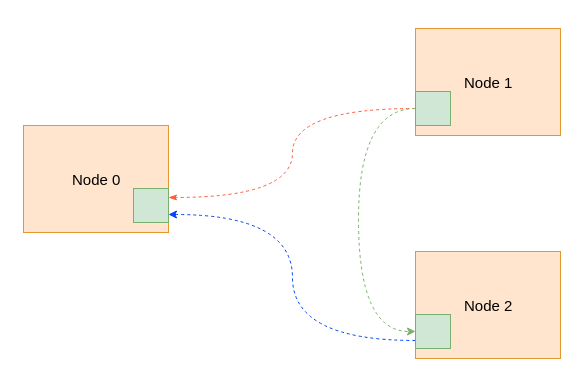
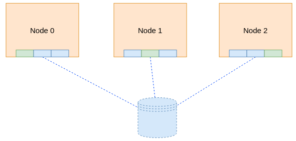
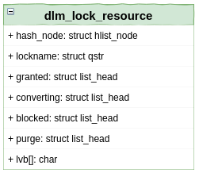
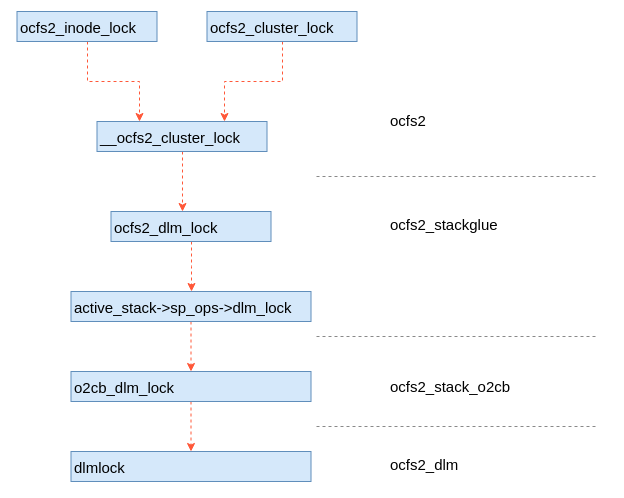

## 整体架构
OCFS2文件系统整体比较复杂，涉及的内核模块多达七八个。各个内核模块的名称及调用关系如图1所示。为了便于理解，我们对这个软件模块关系进行简化。简化后如图2所示。关于各个模块的详细分析我们放在后面，这样更利于理解。


简化后的软件栈变得比较简单，大概分为3层。从下网上分别是集群层，分布式锁和OCFS2文件系统。集群层用于建立一个集群的联系，也就是联通网络通信。分布式锁（DLM）层是分布式锁的具体实现，向文件系统层面提供抽象的、简单的锁接口。文件系统层是OCFS2文件系统的具体实现，其实现方式与常规文件系统并没有什么明显差异，只是在某些地方调用了分布式锁，以避免集群场景下多个节点对资源的冲突访问。


通过图2可以看到，下层是上层的基础，因此我们从下往上逐层介绍OCFS2文件系统各个组件的实现原理。为了便于后续阅读OCFS2文件系统的代码，本文会偶尔提到一些代码的信息，但不会大篇幅的贴源代码。
## 集群
集群管理的核心实现在ocfs2_nodemanager内核模块中。其代码在内核树的fs/ocfs2/cluster文件夹内，网络通信基于TCP协议。在集群各个节点启动起来之后，每个节点会根据配置文件中的节点信息向集群中其它节点发起连接请求，从而建立其网络通信的连接。如果以3个节点为例，最后形成的集群如图3所示，其中虚线是TCP连接。整个集群的所有节点其实是一个网状结构。这里需要说明的一点是节点在发起连接和接受连接的时候都会对双方的节点id进行判断，确保接收方的id小于发送方的id的情况才建立连接，否则不建立连接。这样保证在任意两个节点之间只有一个TCP连接，避免不必要的浪费。



### 集群初始化
在OCFS2文件系统中有一个o2cb服务，这个服务实现了对OCFS2文件系统的基本管理。其中比较重要的一点是其根据配置文件（/etc/ocfs2/cluster.conf）生成一个configfs目录树。里面包含整个文件系统集群的几乎全部管理信息，例如集群节点（含节点详情）、心跳间隔、重连间隔等等，如图所示是该目录树的整体结构。但需要注意的是，`heartbeat`目录及其下内容并不是在此时创建的，而是文件系统挂载的时候由mount.ocfs2命令（该命令会调用一个名为ocfs2_hb_ctl的子命令）创建的。


OCFS2文件系统的网络通信是基于TCP协议。我们知道在TCP建立连接是需要服务的进行监听，而客户端进行连接。OCFS2的集群模块建立连接的大概流程是这样的。在configfs构建目录树创建集群节点（上图中ocfstest->node->ol6u9ext4路径）相关内容时，如果判断某个节点下local的值为1，也即该配置项节点就是本物理服务节点（注：这里物理服务节点并不是指物理服务器，可以是虚拟机等任何计算节点），那么就会起一个TCP的监听。同时需要了解的是，在设置节点编号（node->ol6u9ext4->num）时会对集群结构体（o2nm_cluster）中的cl_nodes成员进行填充，该成员是一个o2nm_node类型的数组，后续DLM中会用到相关的内容。

前面已描述，本地监听是configfs构建目录项的时候触发的。其具体实现在ocfs2/cluster/nodemanager.c文件中，该文件中定义了在构建（和查看）目录树每一级目录项时会触发的动作。而上文中所说的，对某个节点下local项写数据时会触发o2nm_node_local_write函数，正是该函数触发了监听的建立。函数调用过程如下。

```
o2nm_node_local_write->o2net_start_listening->o2net_open_listening_sock
```

在函数o2net_open_listening_sock内部调用内核的系统创建套接字等一系列API完成了监听的发起。同时在此时注册了一个回调函数，当有客户端发起连接时会触发回调函数进行具体的处理。

除了完成套接字监听的建立外，这里还同时创建了一个名为o2net的独立线程工作队列（变量名为o2net_wq），另外创建变量名为o2net_listen_work工作任务（回调函数为o2net_accept_many）。当有客户端的连接请求时，套接字的回调函数会将上述工作任务提交给该工作队列进行处理。而该任务的作用就是接受连接请求，并创建一个新的套接字用于跟客户端进行通信。


同理，TCP的连接也是在构建目录的时候发起的，但不同点在于连接是在挂载文件系统时，通过mount命令构建heartbeat目录时发起的。在构建heartbeat目录并完成基本信息的填充后，会触发内核启动一个内核线程。在该内核线程（o2hb_thread）内部会不断的触发心跳检测流程，在符合条件的情况下会发起网络连接请求。这样，由于有前面的监听和这里的发起连接的请求，最终会建立各个节点之间的网络通信，最后形成一个通信网络。这里形成的通信网络作为后续分布式锁的实现基础，分布式锁的整个通信就是依赖该通信网络。

### 磁盘心跳

除了网络连接之外，OCFS2文件系统的核心心跳机制其实是磁盘心跳，因为对于网络心跳，在2节点的情况下，如果出现网络连接的异常，节点是无法进行决策的。比如出现网络交换机故障，两个节点可能都会判断对方死亡，从而出现对磁盘的访问冲突。因此，这种情况下磁盘心跳就很必要了。磁盘心跳就不存在这样的问题，只要是节点对应区域的磁盘心跳信息没有更新，那必然是节点无法访问该磁盘（可能是节点宕机或者连接磁盘的链路故障），因此也不会出现磁盘访问冲突的问题。



如图所示，OCFS2会在磁盘上划分一块磁盘区域用于做磁盘心跳，该区域按照512大小进行划分切割，每个节点可以使用一块。节点可以使用的区域以本节点的编号进行区分。这样不同的节点可以访问不同的磁盘区域，避免访问冲突。

## 分布式锁
OCFS2的分布式锁基于Kristin Thomas提出的理论实现。分布式锁是在集群环境下实现多个节点协同的，确保被访问的资源不会因为并发而出现不一致的情况。可以对比本地锁的概念理解分布式锁。

### 架构概述
关于分布式锁的具体实现，需要关注的是有两个概念，一个是锁资源（lock resource），另外一个是锁（lock）。被锁的项被定义为锁资源，在一个应用第一次请求对资源进行加锁时，锁管理器会创建一个锁资源，锁资源是与实际资源相关联的。需要注意的是，一个锁资源可能会与多个锁相关联，但一个锁只能与一个锁资源关联。

分布式锁的架构上并没有定义集群主节点的概念，而是以资源为粒度定义资源的主节点，这样每个节点都可以成为主节点，只不过是针对不同的资源。在OCFS2中，分布式锁资源是以inode为粒度进行的。由于没有集群主节点的概念，这样就可以将负载分摊在集群的所有节点上，从而避免单节点导致的性能瓶颈，同时也减少了主节点宕机时选择新主节点后的信息重构时间。

锁资源该概念上需要包含至少3类组件，分别是：

- 名称
- 一个锁值块（lock value block， 简称LVB）
- 一个锁队列的集合

OCFS2具体实现的UML类图如图6所示，这里省略了部分成员。其中lockname是锁资源的名称，lvb是存储锁值块的字符数组，而granted、converting和blocked则是相关的队列。



### 分布式锁的模式
在DLM中，锁被定义为多种模式，以便于适应不同的应用场景。如表是各个模式的解释及互斥情况。

|模式   |正在请求的进程   |    其它进程     |
|-----|-----|-----|
|Null (NL)| 无连接 | 可以进行读或者写 |
|并发读 (CR)| 只允许读 |读或者写|
|并发写 (CW)| 读或者写 |读或者写|
|保护读 (PR) |只允许读 |只允许读|
|保护写 (PW) |读或者写 |只允许读|
|互斥 (EX) |读或者写| 不允许访问|

### 基本流程
分布式锁模块涉及的流程很多，本文重点描述一下加锁的流程，其它流程后续介绍。OCFS2文件系统在具体实现的时候实现了一个粘合层，增加该粘合层的目的是为了在不同栈的情况下，为上层提供统一的接口。如图7为加锁接口的模块栈，最上层为ocfs2文件系统模块，然后依次是ocfs2_stackglue、ocfs2_stack_o2cb和ocfs2_dlm。

**ocfs2_stackglue**就是前面说的粘合层，这个为ocfs2文件系统提供统一的接口。
**ocfs2_stack_o2cb**是栈插件，这个就是o2cb插件，是我们默认使用的插件。
**ocfs2_dlm**是分布式锁的具体实现，具体的锁协议在该模块中实现。

这里还有另外的栈插件，这样可以使用用户态的集群管理软件，增加了OCFS2文件系统的普适性。



分布式锁的核心实现在dlmlock函数中，这个函数是ocfs2_dlm模块的一个函数。另外还有一个dlmunlock的函数，实现解锁的功能。我们先看一下这2个函数的声明。

```
enum dlm_status dlmlock(struct dlm_ctxt *dlm, int mode,
                        struct dlm_lockstatus *lksb, int flags,
                        const char *name, int namelen, dlm_astlockfunc_t *ast,
                        void *data, dlm_bastlockfunc_t *bast)

enum dlm_status dlmunlock(struct dlm_ctxt *dlm, struct dlm_lockstatus *lksb,
                          int flags, dlm_astunlockfunc_t *unlockast, void *data)

```


## 主要数据结构


## dlm_lock旗标分类

- DLM_LKF_NOQUEUE
Do not queue the lock request on the wait queue if it cannot be granted immediately.  If the lock cannot be granted because of this flag, DLM will either return -EAGAIN from the dlm_lock call or will return 0 from dlm_lock and -EAGAIN in the lock status block when the AST is executed.
在无法立刻获得授权的情况下，不将锁请求放入等待队列。如果由于该旗标的原因，锁无法获得授权，DLM将从dlm_lock调用返回-EAGAIN，或者在AST执行的情况下，dlm_lock调用返回0且在锁状态块中返回-EAGAIN。

- DLM_LKF_CANCEL
Used to cancel a pending lock request or conversion.  A converting lock is returned to its previously granted mode.
用于取消一个阻塞的锁请求或者转换。一个正在转换的锁讲话返回其前一个授权模式。

- DLM_LKF_CONVERT
Indicates a lock conversion request.  For conversions the name and namelen are ignored and the lock ID in the LKSB is used to identify the lock.
标识一个锁转换请求。对于转换请求，名称和名称长度将被忽略，LKSB中的锁ID将被用于识别该锁。

- DLM_LKF_VALBLK
Requests DLM to return the current contents of the lock value block in the lock status block.  When this flag is set in a lock conversion from PW or EX modes, DLM assigns the value specified in the lock status block to the lock value block of the lock resource.  The LVB is a DLM_LVB_LEN size array containing application-specific information.
请求DLM返回位于锁状态块（lock status block，简称LSB）中锁值块(lock value block，简称LVB)的内容。当该旗标在一个从PW模式或者EX模式的锁转换时，DLM将定义在锁状态块中的值赋予锁资源中的锁值块。LVB是一个包含应用程序相关信息的，长度为DLM_LVB_LEN的数组。

- DLM_LKF_QUECVT
Force a conversion request to be queued, even if it is compatible with the granted modes of other locks on the same resource.

 70  *
- DLM_LKF_IVVALBLK
Invalidate the lock value block.
使锁值块失效。

- DLM_LKF_CONVDEADLK
Allows the dlm to resolve conversion deadlocks internally by demoting the granted mode of a converting lock to NL.  The DLM_SBF_DEMOTED flag is returned for a conversion that's been effected by this.

- DLM_LKF_PERSISTENT
Only relevant to locks originating in userspace.  A persistent lock will not be removed if the process holding the lock exits.

- DLM_LKF_NODLCKWT
Do not cancel the lock if it gets into conversion deadlock. Exclude this lock from being monitored due to DLM_LSFL_TIMEWARN.

- DLM_LKF_NODLCKBLK
net yet implemented

- DLM_LKF_EXPEDITE
Used only with new requests for NL mode locks.  Tells the lock manager to grant the lock, ignoring other locks in convert and wait queues.

- DLM_LKF_NOQUEUEBAST
Send blocking AST's before returning -EAGAIN to the caller.  It is only used along with the NOQUEUE flag.  Blocking AST's are not sent for failed NOQUEUE requests otherwise.

- DLM_LKF_HEADQUE
107  *
108  * Add a lock to the head of the convert or wait queue rather than the tail.
109  *
110  * DLM_LKF_NOORDER
111  *
112  * Disregard the standard grant order rules and grant a lock as soon as it
113  * is compatible with other granted locks.
114  *
115  * DLM_LKF_ORPHAN
116  *
117  * Acquire an orphan lock.
118  *
119  * DLM_LKF_ALTPR
120  *
121  * If the requested mode cannot be granted immediately, try to grant the lock
122  * in PR mode instead.  If this alternate mode is granted instead of the
123  * requested mode, DLM_SBF_ALTMODE is returned in the lksb.
124  *
125  * DLM_LKF_ALTCW
126  *
127  * The same as ALTPR, but the alternate mode is CW.
128  *
129  * DLM_LKF_FORCEUNLOCK
130  *
131  * Unlock the lock even if it is converting or waiting or has sublocks.
132  * Only really for use by the userland device.c code.

