本文主要介绍一下OCFS2文件系统写数据的流程，以及数据在磁盘的布局情况。在OCFS2文件系统中，文件数据的管理分为2种模式，对于非常小的文件，可以直接放在inode节点所在的区域，也就是inode内部；而对于inode无法容纳的数据则通过B+树的方式放在inode外的其它存储区域，通过inode内的成员指向数据的位置。

将数据直接放置在inode内部的方式成为inline模式，这种模式是最简单的，因此我们先介绍这种模式。另外，本文章的目的是理解OCFS2的具体代码实现，因此在介绍的过程中会贴一部分代码，但不会太多，主要考虑到太多的代码可能会影响全文的连贯性。为了便于从整体上理解，本文包含了部分VFS内容的介绍。

写文件的操作通常由用户态的程序发起，比如在开发的过程中调用系统API（write）。如图是从用户态发起一直到调用OCFS2函数的整个调用流程。从用户态到内核态是触发了一个中断，这里我们不关心其具体实现，其作用是触发对内核函数的调用。最开始的内核函数是VFS的函数，VFS是一个中间抽象层，其目的是为用户提供统一的接口，屏蔽不同文件系统间的差异。VFS会调用具体文件系统的函数，这里是调用OCFS2文件系统的ocfs2_file_write_iter函数，能够调用该文件系统的接口是因为inode在初始化的时候填充了该文件系统的一个`文件操作的结构体`实现，关于具体细节本文不做解释，后续再另起文详述。

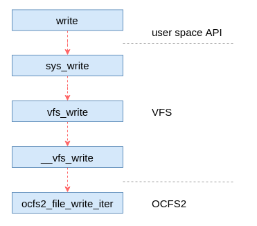

OCFS2文件系统文件操作的结构体实现如代码所示，这里包含了OCFS2文件系统实现的可以对文件进行的操作。包括对文件内容的读写、查找和缓存同步等等，还有文件加锁等操作。

```
const struct file_operations ocfs2_fops = {
        .llseek         = ocfs2_file_llseek,
        .mmap           = ocfs2_mmap,
        .fsync          = ocfs2_sync_file,
        .release        = ocfs2_file_release,
        .open           = ocfs2_file_open,
        .read_iter      = ocfs2_file_read_iter,
        .write_iter     = ocfs2_file_write_iter,
        .unlocked_ioctl = ocfs2_ioctl,
#ifdef CONFIG_COMPAT
        .compat_ioctl   = ocfs2_compat_ioctl,
#endif
        .lock           = ocfs2_lock,
        .flock          = ocfs2_flock,
        .splice_read    = ocfs2_file_splice_read,
        .splice_write   = iter_file_splice_write,
        .fallocate      = ocfs2_fallocate,
};

```
下面是VFS文件系统写操作的代码实现，由该代码可以看出在该函数中将调用具体文件系统的写数据的接口。可能涉及2种情况，视文件系统的具体实现而定。本文ocfs2文件系统实现的是ocfs2_file_write_iter，因此最终会调用该函数（具体在new_sync_write中调用，这里包了一层）。

```
ssize_t __vfs_write(struct file *file, const char __user *p, size_t count,
                    loff_t *pos)
{
        if (file->f_op->write)
                return file->f_op->write(file, p, count, pos);
        else if (file->f_op->write_iter)
                return new_sync_write(file, p, count, pos);
        else
                return -EINVAL;
}
```

通过上面描述，我们基本知道了用户态的接口调用是如何触发到文件系统的函数了，也就是如何调到ocfs2_file_write_iter函数，后面我们详细介绍一下文件系统的实现。

## 公共实现
无论是inline模式还是extent模式，对ocfs2文件系统来说都使用`ocfs2_file_write_iter`函数作为入口，只是在其内部进行了区分。为了保证写数据的安全性，避免进程之间的竟态导致数据的不一致，在写数据的时候会有一些锁。为了抓住主要逻辑，本文暂时不介绍参数合法性检查和锁等其它逻辑内容，这些内容后续专门介绍。

如图2所示，其中绿色的是写流程的主要函数，该函数实现磁盘空间分配和实际的写数据的操作，主要业务逻辑也在该函数中。而函数`filemap_fdatawrite_range`则是在文件具备同步刷写属性的情况下，实现缓存写数据的同步刷写，保证数据从缓存刷写到磁盘后在返回。因此，本文重点介绍__generic_file_write_iter函数，这个函数是整个文件写数据的核心。

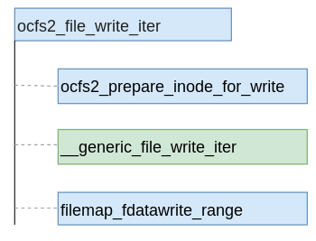

该函数并不是ocfs2文件系统的函数，而是一个公共函数（mm/filemap.c中实现）。在该函数中，针对用户打开文件时设置的属性有两种不同的执行分支，如果设置了O_DIRECT属性，则调用`generic_file_direct_write`函数进行直写的流程；如果没有设置该属性，则调用函数`generic_perform_write`执行缓存写的流程。

### 直写流程
所有文件系统的直写都有一个公共的入口generic_file_direct_write，这个函数在框架中实现（mm/filemap.c）。该函数流程相对比较简单，主要调用了4个函数，具体如图所示。前面两个函数是对目的区域的缓存进行刷写，并使缓存页失效。进行这一步的主要原因是缓存中可能有脏数据，如果不进行处理可能会导致缓存的数据覆盖直写的数据，从而导致数据不一致。第3个函数direct_IO是文件系统的实现，直写真正的写数据操作。最后一个函数在上面已经执行过，主要是避免预读等操作导致缓存数据与磁盘数据的不一致。

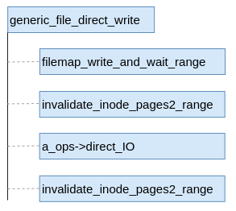
### 缓存写流程
与直写类似，缓存写也有一个公共函数，其名称为generic_perform_write。缓存写整体的主要流程也有4个主要步骤，分配磁盘空间和缓存页，将数据从用户态拷贝到内核态内存、收尾和页缓存均衡。

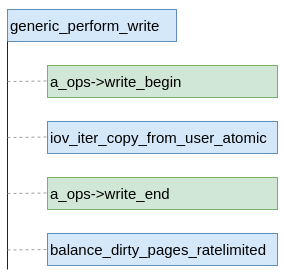

其中分配磁盘空间和缓存页以及收尾工作实在具体文件系统中做的。页缓存均衡的作用是检查目前页缓存的容量，保证页缓存的总容量不超过设置的水线大小，避免占用系统内存太多。上图中是函数指针方式的调用，具体到文件系统有各自的实现，对于ocfs2来说实现如下代码所示（在aops.c中）。

```
const struct address_space_operations ocfs2_aops = {
        .readpage               = ocfs2_readpage,
        .readpages              = ocfs2_readpages,
        .writepage              = ocfs2_writepage,
        .write_begin            = ocfs2_write_begin,
        .write_end              = ocfs2_write_end,
        .bmap                   = ocfs2_bmap,
        .direct_IO              = ocfs2_direct_IO,
        .invalidatepage         = block_invalidatepage,
        .releasepage            = ocfs2_releasepage,
        .migratepage            = buffer_migrate_page,
        .is_partially_uptodate  = block_is_partially_uptodate,
        .error_remove_page      = generic_error_remove_page,
};
```

上面都是公共框架的工作，对于所有文件系统都是一样的，整体逻辑也比较简单。了解了公共框架的部分的工作后，我们后续介绍ocfs2文件系统所做的工作。对于直写部分的逻辑本文暂时不做介绍，主要集中在缓存写逻辑的相关内容。我们知道根据文件大小的不同，ocfs2数据布局可以是inline和extent两种模式，虽然其代码实现是混在一起的，但为了方便理解，本文分别进行介绍。
## inline模式写数据
在ocfs2文件系统中，inline模式是最简单的情况，在这种情况下文件的数据直接存储在inode的剩余空间中。在OCFS2的inode里面有一个名称为id2的联合体成员，对于inline模式情况下，该成员为ocfs2_inline_data类型的结构体。如下是截取的inode代码片段，该代码片段只包含联合体部分。

```
/*C0*/  union {
                struct ocfs2_super_block        i_super;
                struct ocfs2_local_alloc        i_lab;
                struct ocfs2_chain_list         i_chain;
                struct ocfs2_extent_list        i_list;
                struct ocfs2_truncate_log       i_dealloc;
                struct ocfs2_inline_data        i_data;
                __u8                            i_symlink[0];
        } id2;
```

为了简化，本文做了一个关于ocfs2的inode的示意图，具体如下。如图5所示，在inode结构体偏移0xC0的地方是该成员开始的地方，然后包含id_count成员变量和id_data变量，其中id_count表示可用于存储数据的字节数，id_data变量是一个字符型的数组，就是存储文件数据的起始位置（如图红色部分）。

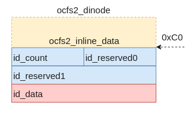

### 主要流程
根据前文的描述我们知道，跟ocfs2相关的代码逻辑其实只有ocfs2_write_begin和ocfs2_write_end两个函数。因此，本文也以这两个函数为起点进行介绍。我们按照先后顺序进行介绍，首先介绍ocfs2_write_begin函数，这个函数进行磁盘空间分配和页缓存的分配。

进入该函数后，首先判断文件系统是否支持inline模式（根据超级块中的属性是否具有OCFS2_FEATURE_INCOMPAT_INLINE_DATA进行判断），如果支持则直接进入inline模式的处理流程。在该种情况下ocfs2_write_begin函数的整体处理流程比较简单，具体如图6所示。另外，本文暂时不考虑本次写数据太大，导致inode无法容纳数据，需要转换为extent的情况。因为这种情况其实与纯extent模式差异不大，因此可以参考后面章节理解，本文不单独介绍。

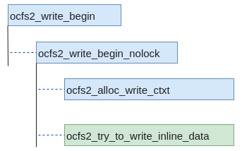

由图可见，这里只涉及2个函数，其中ocfs2_alloc_write_ctxt函数只是初始化一个中间变量，起辅助作用。因此，整个处理逻辑中的关键其实是`ocfs2_try_to_write_inline_data`函数，在该函数中满足inline写的情况下直接调用了ocfs2_write_begin_inline函数，如图7是ocfs2_write_begin_inline函数内部的实现逻辑。

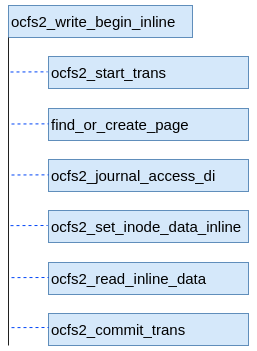

关于ocfs2_write_begin_inline函数的流程，包含3部分逻辑功能，分别是：
1. 事务相关逻辑，包括ocfs2_start_trans、ocfs2_journal_access_di和ocfs2_commit_trans，分别是启动事务、添加需要事务处理的逻辑块和完成事务提交。由于这里涉及元数据的操作，因此启动了一个事务，防止由于断电等原因导致损坏文件系统。这里我们只要了解到这里就行，暂时不需要深入了解。
2. 分配缓存页，函数find_or_create_page用于分配一个缓存页，这个缓存页用于存储用户层写的数据。这个函数首先会从inode的基数树查找是否已经存在，如果不存在则从系统申请一个新的页。
3. 读取磁盘数据，这个逻辑不是必需的，如果缓存页中的数据是最新的数据，则不需要该步骤。如果是新分配的缓存页，则需要先从磁盘读取数据，并填充到缓存页中。进行该步的主要原因是用户写的数据未必能够覆盖整个缓存页。

好了，我们整体介绍一下这个流程，其大意就是要申请一个缓存页用于存储用户传输的数据，为了保证数据不发生冲突，可能需要提前从磁盘读取数据填充该缓存页。这里需要注意的是，因为inline情况下数据最终是存储在inode内部的，因此`这里并没有分配磁盘空间的流程`。

根据总体流程图4，这里有一步从用户态拷贝数据到内核态的流程，其目的内存空间就是上一步分配的缓存页。这样，后面就可以使用该缓存页，将数据写到inode的数据区域。

最后，函数cfs2_write_end进行收尾工作。关键路径是这样的`ocfs2_write_end->ocfs2_write_end_nolock->ocfs2_write_end_inline`。最后一个函数的实现如下代码（删除了一些非关键代码），可以看出数据被拷贝到inode的id_data成员所在的位置。

```
static void ocfs2_write_end_inline(struct inode *inode, loff_t pos,
                                   unsigned len, unsigned *copied,
                                   struct ocfs2_dinode *di,
                                   struct ocfs2_write_ctxt *wc)
{
        void *kaddr;
		... ...
        kaddr = kmap_atomic(wc->w_target_page);
        memcpy(di->id2.i_data.id_data + pos, kaddr + pos, *copied);
        kunmap_atomic(kaddr);
        ... ...
}

```

至此，完成了inline模式下写数据的整个流程，整体来看，逻辑还是比较简单的。

## extent模式
在extent模式下场景比较多，如果多个场景混合在一起介绍势必比较复杂，也比较混乱。因此，本文先集中一种场景，基于这种场景理解其中最为核心的流程。这样，之后其它场景的理解也就变得比较简单。本文先介绍支持稀疏文件（spare）且没有reflink的场景。

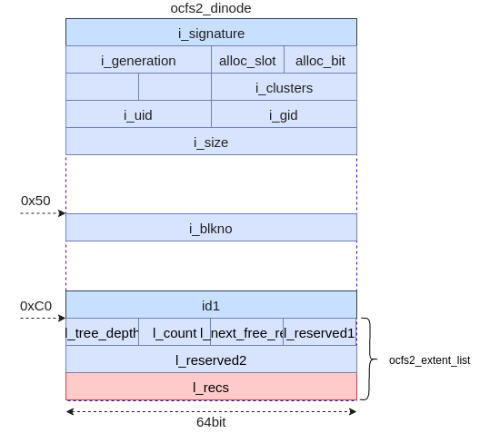

在该种场景下，ocfs2的inode中的id2成员的类型就变成了ocfs2_extent_list结构体，具体如上图所示。此时inode中的该成员可以理解成为B+
树的树根。如果文件比较大，且写数据的时候存在很多空洞的情况下，就会形成一个比较复杂的B+树。

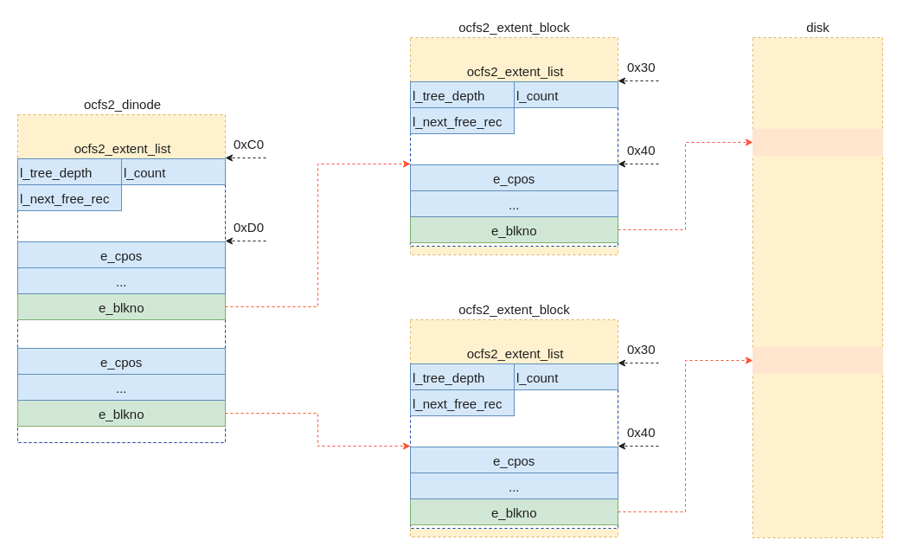

如上图是B+树的示意图，其中涉及的数据结构在图上都做了标注。同时，对于数据成员的偏移地址也做了标注。通过上图应该可以很清晰的了解涉及的数据结构（ocfs2_dinode/ocfs2_extent_block/ocfs2_extent_list/ocfs2_extent_rec）及关系，为了不使本文太乱，这里就不过多的贴代码了。本文只贴一下ocfs2_extent_rec结构体的代码。该结构体可以理解为是一个extent，其在不同情况下定义不同，分两种场景，一种是作为中间节点，另外一种是叶子节点。

```
struct ocfs2_extent_rec {
/*00*/  __le32 e_cpos;          /* Offset into the file, in clusters */
        union {
                __le32 e_int_clusters; /* 如果为非叶子节点时使用，Clusters covered by all children */
                struct {
                        __le16 e_leaf_clusters; /* 叶子节点时使用，表示该extent覆盖的簇的数量。
                                                   Clusters covered by this
                                                   extent */
                        __u8 e_reserved1;
                        __u8 e_flags; /* Extent flags */
                };
        };
        __le64 e_blkno;         /* Physical disk offset, in blocks */
/*10*/
};
```
作为中间节点的情况下，该结构体中联合体成员为e_int_clusters类型，该成员描述了该中间节点下所有子节点包含的簇的数量。在叶子节点的情况下，该联合体定义为一个结构体，其中e_leaf_clusters成员描述了该extent涵盖的簇的数量。

### 主要流程
如图是从入口函数开始主干调用关系，其中具体实现在ocfs2_write_begin_nolock函数中。在该函数中我们可以总结为3步，分别是：
1. 生成write_desc并计算需要的簇的数量（ocfs2_populate_write_desc），write_desc用于描述没一个extent的簇的使用情况。
2. 获取页缓存(ocfs2_grab_pages_for_write)，根据簇的数量获取对应的页缓存，为后面将用户态内容拷贝到内核态做准备。
3. 分配簇(ocfs2_write_cluster_by_desc)，根据write_desc的描述分配簇，这里主要是将簇管理结构体中位图（bitmap）的对应位进行置位操作。另外还会对第2步中的页进行处理，建立页与磁盘块之间的映射关系。
上述3步中有一种情况没有介绍，就是写请求的偏移大于文件大小的情况下会做一个特殊处理（ocfs2_zero_tail），这个我们后续在详细介绍。

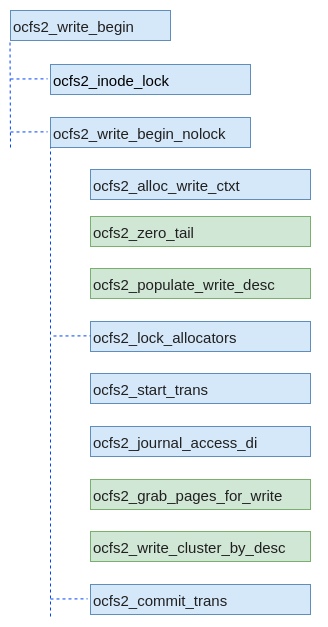

结合图3，完成上述操作后，在VFS中就可以将用户态的数据拷贝到这里准备的页缓存当中，然后调用ocfs2_write_end函数更新页的状态（脏页状态），以便于内核可以将页缓存中的数据写入磁盘。

### 计算簇的数量
在支持稀疏文件的场景下文件的情况会比较复杂。由于文件可能会存在任何形式的空洞，而稀疏文件模式下为了节省磁盘的空间在分配簇的时候一般都是连续的，这样在后续写数据时情况就比较复杂。如图所示为文件数据与磁盘数据的对应关系，左边是文件数据，右边是磁盘数据。为了简单我们假设图中蓝色方框为1个簇大小的数据，空洞的大小也是1个簇的大小。假设一开始写文件的时候为每间隔1个簇写1个簇的数据，这样在磁盘上的数据通常是连续的。然后我们对该文件进行修改，在第一个空洞的地方写入1个簇的数据，这个时候在磁盘上显然没有与上一个簇地址连续的磁盘空间，因此需要分配新的磁盘空间（可能会会追加到当前数据的末尾，但不一定）。

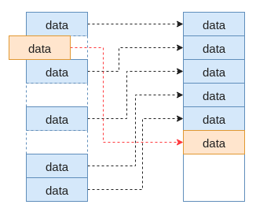

这个例子只是一个最简单的例子，实际生产环境可能会产生各式各样的文件，因此文件逻辑位置与磁盘物理位置的关系会非常复杂。

计算需要簇数量并填充ocfs2_write_cluster_desc的实现在`ocfs2_populate_write_desc`函数中。该函数中一个非常重要的参数就是ocfs2_write_ctxt结构体，该结构体用于写数据时各个函数间关键信息的传递。而函数`ocfs2_populate_write_desc`则是用于填充其成员变量w_desc的，两种之间的关系如下代码所示。

```
struct ocfs2_write_ctxt {
	... ...
	struct ocfs2_write_cluster_desc w_desc[OCFS2_MAX_CLUSTERS_PER_PAGE];
    ... ...
}
```

本文上面代码省略了一些不必要的代码，w_desc成员是一个数组，其主要针对大页内存情景而存在，该数组大小与大页的大小有关。由于ocfs2簇最小为4K，因此这里定义数组的大小定义为页大小除以4K的商，也就是页大小对于4K的倍数。这样就可以通过该成员变量描述每一个簇的情况（包括簇的逻辑地址、物理地址和一些附加属性）。后续流程正式通过该成员遍历确定是否需要分配新的簇来存储数据。

为了便于理解，我们这里举一个例子，假设操作系统页大小为512K，ocfs2文件系统簇大小为128K。此时，由于ocfs2簇最小为4K，因此上述w_desc数组的大小为128个（512/4），但在使用的时候不会全部使用上，如果格式化的时候簇大小是4K可能会全部用上。如图右面的方格代表文件的逻辑地址，每一个方格大小是128K，蓝色代表有数据，白色代表是空洞。中间是本次期望写入的数据，大小是128K*3，也即需要使用3个簇。左面是w_desc数组，用于对簇进行描述。

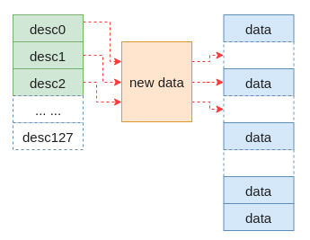

在函数ocfs2_populate_write_desc中，由于待写如数据第一个簇在现有文件上是一个空洞，因此需要新分配一个簇，此时按照规则填充desc0，其中比较重要的是由于当前没有对应的簇，因此物理地址为0。对于第二个簇由于已经有数据，以及对应的物理簇，因此其物理地址是该物理簇的地址。以此类推，填充每一个desc。

如果计算出来需要分配新的簇，此时会调用ocfs2_lock_allocators函数，该函数用于检查空间分配inode是否有足够的空间，如果一切顺利的情况下，会对其进行锁定，阻塞其它进程的访问。
### 获取缓存页
通过调用函数ocfs2_grab_pages_for_write分配需要的缓存页，该函数比较简单，不再过多介绍了。

### 分配需要的簇
最后，调用ocfs2_write_cluster_by_desc函数进行实际的空间分配,函数根据之前desc的描述信息逐一分配簇。如下代码，这里删除了一些不必要的代码。从代码可以看出空间分配的核心是ocfs2_write_cluster函数。

```
static int ocfs2_write_cluster_by_desc(struct address_space *mapping,
                                       struct ocfs2_alloc_context *data_ac,
                                       struct ocfs2_alloc_context *meta_ac,
                                       struct ocfs2_write_ctxt *wc, 
                                       loff_t pos, unsigned len) 
{
        ... ...
        for (i = 0; i < wc->w_clen; i++) {
                desc = &wc->w_desc[i];
                ... ...

                ret = ocfs2_write_cluster(mapping, desc->c_phys,
                                          desc->c_unwritten,
                                          desc->c_needs_zero,
                                          data_ac, meta_ac,
                                          wc, desc->c_cpos, pos, local_len);
				... ...
        }
}
```

函数ocfs2_write_cluster主要做两件事情，一个是进行磁盘空间的分配（ocfs2_add_inode_data），另一个是对缓存页进行映射（ocfs2_prepare_page_for_write），建立缓存页与磁盘物理位置的关系。ocfs2_add_inode_data函数负责分配磁盘空间，分配的方式就是根据位图确定那些簇是可以用的，然后将位图置位（__ocfs2_claim_clusters），完成之后对extent的B+树进行更新（ocfs2_insert_extent）。关于磁盘空间分配部分的内容可以单独可以单独写一篇同样长度的文章，本文暂时不过多介绍，读者只需要了解包含上述两个主要步骤即可。ocfs2_prepare_page_for_write函数负责建立缓存页与磁盘逻辑地址的映射关系，这个函数实现逻辑比较简单，可以自行分析。

